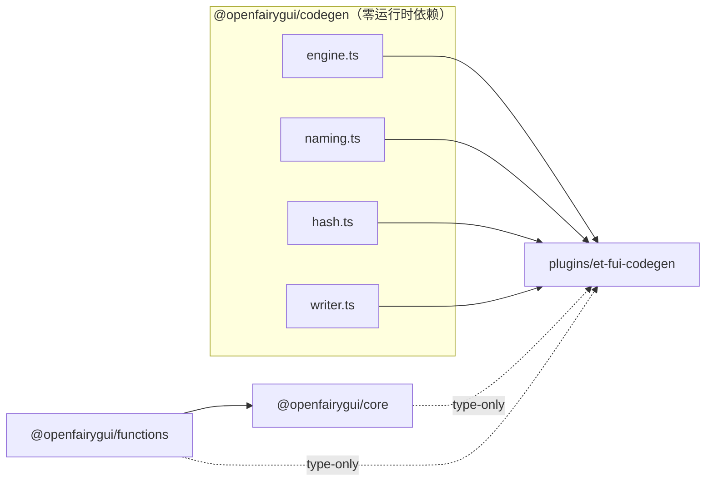

# @openfairygui/codegen 架构设计

任务：把 `plugins/et-fui-codegen` 的通用模板代码生成能力提取为 `packages/codegen`（`@openfairygui/codegen`）正式 npm 包。
本文档只做设计，不修改任何源代码。

## 1. 设计原则（决策基线）

| 原则 | 决策 |
|---|---|
| 硬门槛 | et-fui-codegen 对同一 FairyGUI 工程生成的 C# 文件**逐字节不变**；目录结构、preserved 语义不变 |
| 下沉边界 | 引擎通用化下沉（engine/naming/hash），ET 模板留在插件层（model/templates/index） |
| 不过度设计 | ET 是当前唯一消费方；管线抽象只做「轻量 writer 契约」，不抽象 model 中间模型 |
| 零外部依赖 | 新包保持零运行时依赖（模板引擎零依赖） |
| 工程惯例 | 对齐 `packages/core` / `packages/functions`：tsdown 构建、ESM+CJS、`workspace:*` 协议、biome lint、ava 测试、release.yml 发布链路 |

## 2. 通用性边界判定（对 requirements.md 审计表的落地裁决）

| 源文件 | 裁决 | 去向 |
|---|---|---|
| `engine.ts` (182行) | ✅ 完全通用 | 原样迁移 → `packages/codegen/src/engine.ts` |
| `naming.ts` (122行) | ✅ 通用（C# 目标语言工具 + 路径工具） | 原样迁移 → `packages/codegen/src/naming.ts` |
| `hash.ts` (16行) | ✅ 通用算法，但 `hashPanelId` 的入参语义是 FairyGUI/ET 专属 | 算法下沉为 `fnv1a31(value)` → `packages/codegen/src/hash.ts`；ET 命名封装 `hashPanelId(packageId, componentId)` 留在插件侧（约 4 行薄封装） |
| `model.ts` (380行) | ⚠️ 混合 | **整体留在插件层**。`buildCodegenOutputs` / `EtCodegenOutput` / remark `Type:View/Layer` 约定是 ET 专属；其依赖的 naming/hash 改为从新包导入。不做 FairyGUI→中间模型的通用抽象（唯一消费方，避免过度设计） |
| `templates.ts` + `templates/*.tpl` | ❌ ET 专属 | 留在插件层；`AUTO_GENERATED_MARK` / `PRESERVED_MARK` 文案保留在模板层，不进入 writer 契约 |
| `index.ts` (149行) | ⚠️ 混合 | Plugin 钩子接入与 ET 目录布局留在插件层；「overwrite vs preserve-if-missing 写文件策略」下沉为轻量 writer 契约 |

## 3. 包结构与模块划分

```
packages/codegen/
├── package.json
├── README.md
├── LICENSE
├── src/
│   ├── index.ts          # 公开导出（引擎 + 命名 + 哈希 + 可选 writer）
│   ├── engine.ts         # renderTemplate / TemplateContext（原样迁移）
│   ├── naming.ts         # C# 标识符工具 + 路径工具（原样迁移）
│   ├── hash.ts           # fnv1a31（原 hashPanelId 算法，参数泛化）
│   └── writer.ts         # 轻量 writer 契约（新抽象，可选）
└── test/
    ├── engine.test.ts    # 由 scripts/smoke-test.ts 断言迁移 + 补充
    ├── naming.test.ts
    ├── hash.test.ts
    └── writer.test.ts
```

不设 `tsdown.config.ts`（core 用它是因为需要 `__OPENFAIRYGUI_PACKAGE_VERSION__` define；codegen 不需要）。
不设包内 `tsconfig.json`（core/functions 均不设，根 `tsconfig.json` 的 `packages/*` include 已覆盖）。

## 4. 公开 API 签名

### 4.1 模板引擎 `src/engine.ts`

```ts
export interface TemplateContext {
    scalars: Record<string, string>;                    // $key$ 标量
    loops: Record<string, Record<string, string>[]>;    // $item.field$ 循环行
}

export function renderTemplate(template: string, ctx: TemplateContext, strict?: boolean): string;
```

语法与语义**原样保留**：`$key$` 标量、`$item.field$` 循环字段、`//$for item in list$`…`//$endfor$`、`//$if expr$`…`//$endif$`；strict 模式未解析 token 抛错。`strict` 缺省为 `true`。

### 4.2 命名工具 `src/naming.ts`

```ts
export function normalizeTypeName(value: string, fallback?: string): string;   // PascalCase 类型名，默认 'Component'
export function normalizeMemberName(value: string, fallback?: string): string; // 成员名，默认 'member'
export function ensureCSharpIdentifier(value: string): string;                 // 数字前缀 / C# 关键字转义
export function escapeCSharpString(value: string): string;
export function isAbsolutePath(value: string): boolean;
export function trimTrailingSlashes(value: string): string;
export function resolveProjectBasePath(basePath: string | undefined): string;
```

### 4.3 稳定哈希 `src/hash.ts`

```ts
/** FNV-1a 32-bit → 31-bit 正数；32 位算术保证各 JS 运行时结果一致。 */
export function fnv1a31(value: string): number;
```

原 `hashPanelId(packageId, componentId)` 即 `fnv1a31(\`${packageId}:${componentId}\`)`。
该 ET 语义封装（含 `export { hashPanelId }` 公开面）保留在插件侧薄封装文件，行为与现实现完全一致。

### 4.4 可选轻量 writer 契约 `src/writer.ts`

只抽象「overwrite vs preserve-if-missing + 目录创建 + 计数」这一通用写文件策略，不抽象目录布局与模板渲染：

```ts
export interface CodegenWriteFile {
    filePath: string;                 // 绝对或工程相对路径
    content: string;
    mode: 'overwrite' | 'preserve';   // preserve：已存在则跳过
}

export interface CodegenWriterFs {
    mkdir(path: string): Promise<void>;
    writeFileRaw(path: string, bytes: Uint8Array): Promise<void>;
    exists?(path: string): Promise<boolean>;
    readFileRaw?(path: string): Promise<Uint8Array>;
}

export interface CodegenWriteResult {
    written: number;          // 实际写入文件数
    preserved: number;        // preserve 模式下已存在被跳过的文件数
    detectUnavailable: boolean; // fs 无 exists/readFileRaw 时无法探测已存在文件
}

export async function writeCodegenFiles(
    fs: CodegenWriterFs,
    options: { directories: string[]; files: CodegenWriteFile[] },
    logger?: { info(message: string): void; warn(message: string): void },
): Promise<CodegenWriteResult>;
```

消费方式：插件 `writeOutput` 把目录布局与渲染好的文件列表构造成 `directories + files`，一次调用完成写入；
preserve 语义、无法探测告警、写入/保留计数均由契约统一处理。`AUTO_GENERATED_MARK` / `PRESERVED_MARK`
是模板文案，不属于契约。

> 若实现阶段发现该抽象与插件耦合超过预期，允许放弃 writer 抽象、保持 `writeOutput` 留在插件内；
> 此时不改变任何生成产物（行为不变优先于抽象整洁）。

## 5. 公开入口 `src/index.ts`

```ts
export { renderTemplate } from './engine.js';
export type { TemplateContext } from './engine.js';

export {
    normalizeTypeName,
    normalizeMemberName,
    ensureCSharpIdentifier,
    escapeCSharpString,
    isAbsolutePath,
    trimTrailingSlashes,
    resolveProjectBasePath,
} from './naming.js';

export { fnv1a31 } from './hash.js';

export { writeCodegenFiles } from './writer.js';
export type { CodegenWriteFile, CodegenWriteResult, CodegenWriterFs } from './writer.js';
```

单入口导出，不设子路径（无 Node/Web 平台分叉需求）。

## 6. 依赖关系



- `@openfairygui/codegen`：**零运行时依赖**（纯 TS，不含 `import`）；devDependencies 仅 `ava`、`tsx`。
- `plugins/et-fui-codegen`：新增 `dependencies: { "@openfairygui/codegen": "workspace:*" }`（运行时依赖，非 devDependency）；
  原有 `@openfairygui/core`、`@openfairygui/functions` 保持 `devDependencies`（两者在插件源码中均为 `import type`，不产生运行时解析）。

### 6.1 运行时解析与部署影响（必须同步文档）

插件当前 README 声称「The plugin has no runtime imports … can load `src/index.ts` directly after this directory is
copied into an FGUI project」。提取后插件对 `@openfairygui/codegen` 产生**运行时 import**，该声称不再成立：

- **`--plugin` 从仓库加载**：不受影响——`packages/` 目录在 workspace 内，`node_modules` 符号链接可正常解析。
- **复制进 FGUI 工程加载**：目标工程 `node_modules` 需能解析 `@openfairygui/codegen`（安装该包或保持 workspace）。
  必须同步更新 `plugins/et-fui-codegen/README.md` 的部署描述。

这是本次提取唯一对插件部署方式有影响的点，且不改变任何生成产物。

## 7. 文件清单

### 7.1 新增 `packages/codegen/`

| 文件 | 内容 |
|---|---|
| `package.json` | `@openfairygui/codegen` v0.1.0，public（不设 `private`），`type: module`，`sideEffects: false`，tsdown 构建脚本，ava 测试配置，`files: ["dist/", "src/"]` |
| `README.md` | 安装、使用示例、API 概览 |
| `LICENSE` | 从 `packages/core/LICENSE` 复制（MIT） |
| `src/index.ts` | 公开导出 |
| `src/engine.ts` | 原 `plugins/et-fui-codegen/src/engine.ts` 逐字迁移 |
| `src/naming.ts` | 原 `plugins/et-fui-codegen/src/naming.ts` 逐字迁移 |
| `src/hash.ts` | `fnv1a31`（原 `hashPanelId` 算法，参数泛化为 `value: string`） |
| `src/writer.ts` | 轻量 writer 契约 |
| `test/engine.test.ts` | engine 断言迁移 |
| `test/naming.test.ts` | naming 断言迁移 |
| `test/hash.test.ts` | hash 断言迁移 |
| `test/writer.test.ts` | writer 契约测试 |

### 7.2 修改 `plugins/et-fui-codegen/`

| 文件 | 变更 |
|---|---|
| `package.json` | 新增 `dependencies: { "@openfairygui/codegen": "workspace:*" }` |
| `src/engine.ts` | **删除**（已下沉） |
| `src/naming.ts` | **删除**（已下沉） |
| `src/hash.ts` | 改写为薄封装：`import { fnv1a31 } from '@openfairygui/codegen'; export function hashPanelId(packageId, componentId) { return fnv1a31(\`${packageId}:${componentId}\`); }`，保留 `export { hashPanelId }` 公开面 |
| `src/model.ts` | `import` 改为 `@openfairygui/codegen`（naming 三件套 + `fnv1a31`），其余逻辑不动 |
| `src/templates.ts` | `import` 改为 `@openfairygui/codegen`（`renderTemplate` + `escapeCSharpString`），其余逻辑不动 |
| `src/index.ts` | naming 路径工具改从 `@openfairygui/codegen` 导入；若采用 writer 契约，`writeOutput` 改为构造 `directories + files` 调用 `writeCodegenFiles` |
| `README.md` | 部署章节更新：插件现在运行时依赖 `@openfairygui/codegen` |

### 7.3 修改仓库级文件

| 文件 | 变更 |
|---|---|
| `tsconfig.json` | `paths` 增加 `"@openfairygui/codegen": ["./packages/codegen/src/index.ts"]` |
| `.github/workflows/release.yml` | 三处包列表（verify / npmjs pack+publish / GitHub Packages）各加 `codegen` |
| `scripts/smoke-test.ts` | engine/naming/hash 的 import 改从 `@openfairygui/codegen`；templates/model 保持插件路径 |
| `README.md` / `README_EN.md` | 包导航表增加 `@openfairygui/codegen` |
| `docs/guide/packages.md` / `docs/en/guide/packages.md` | 包表与公开入口表增加 `@openfairygui/codegen` |
| `docs/architecture-overview.md` | 模块边界表与工作流层说明增加新包 |
| `CHANGELOG_CN.md` / `CHANGELOG.md` | Unreleased 增加新包条目（双语一致） |

`lerna.json` 的 `packages: ["packages/*", "plugins/*"]` 已覆盖新包，无需修改。

## 8. 测试策略

- **新包（自测）**：`engine/naming/hash` 断言迁移自 `scripts/smoke-test.ts`（第 1/2/3/7 组），补充分支用例；
  writer 契约新增测试（overwrite / preserve 已存在跳过 / fs 无探测能力告警 / 计数）。
  根 `pnpm test` 的 ava 配置（`packages/*/test/**/*.test.ts`）自动纳入新包测试。
- **插件（消费侧）**：新增 `plugins/et-fui-codegen/test/` ava 测试，覆盖 `buildCodegenOutputs` 建模、
  render 输出关键断言与 writeOutput 的 preserve 语义（包内 ava 配置已存在于 `package.json`）。
- **字节级回归**：用 `scripts/verify-fgui.ts` 在改造前后对同一 FGUI 工程（ProjZero 样例）生成输出，
  逐字节 diff `test-output/fgui-codegen` 目录（详见 implementation-plan.md 的验证步骤）。

## 9. 明确不做

- 不把 `model.ts` 的 FairyGUI→中间模型抽象为通用管线（唯一消费方，无第二需求）。
- 不把 `templates.ts` 与 `templates/*.tpl` 下沉（模板内容、目录布局是 ET 约定）。
- 不改 `@openfairygui/functions` 内置 `codegen.ts`（另一套内置代码生成，不属于本次范围）。
- 不引入任何新运行时依赖。
