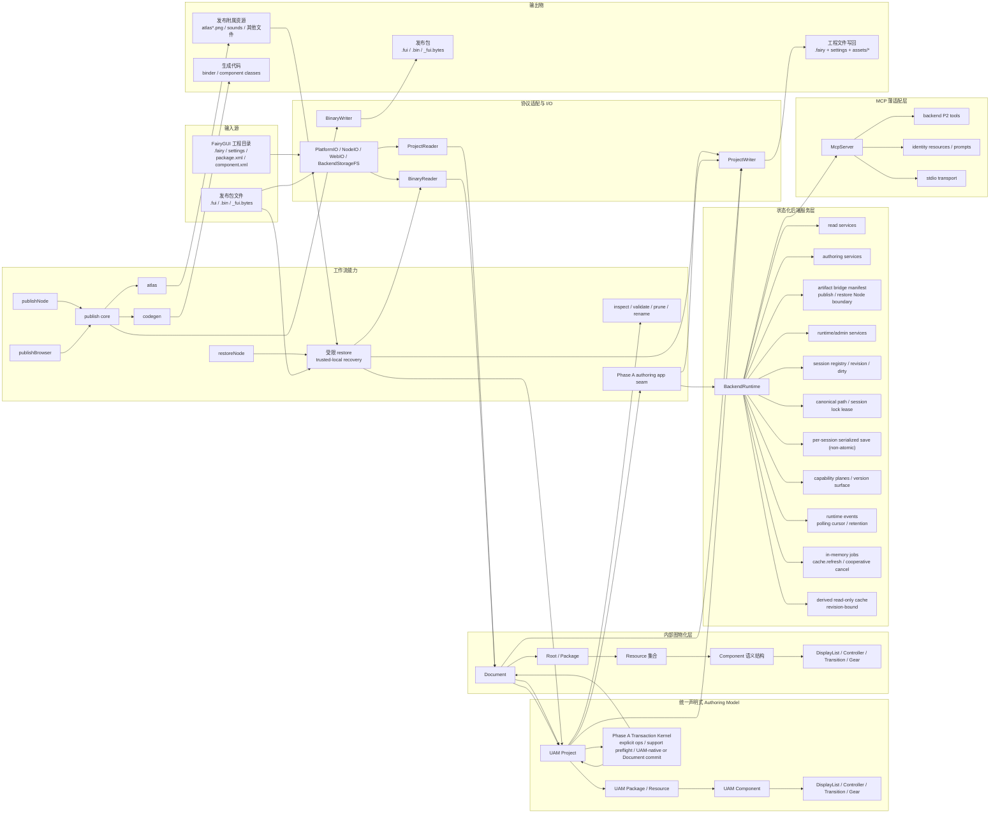
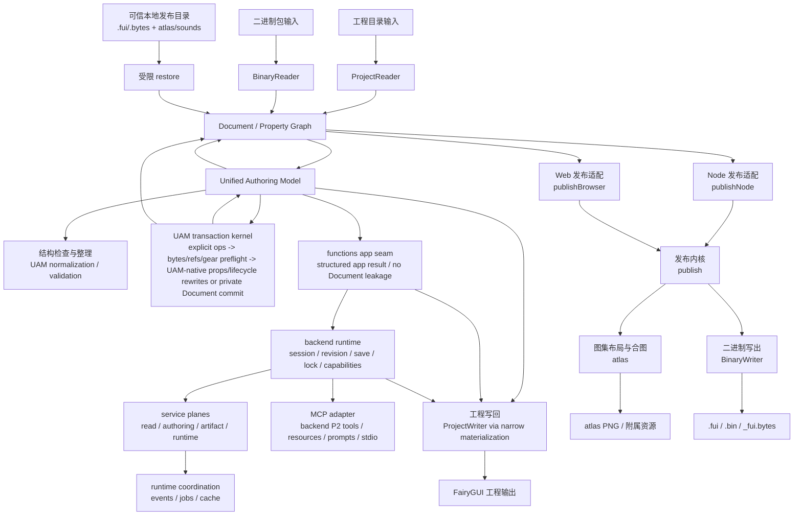

# OpenFairyGUI 架构图说明

## 结论

当前仓库在 **Gate A** 阶段更适合理解成七段式结构：`输入源 -> 协议适配 -> 统一声明式 Authoring Model -> 内部图物化层 -> 工作流 / 后端运行时 -> MCP 薄适配 -> 输出物`。  
其中新的主真相层是 **Unified Authoring Model (UAM)**；`Document + Property Graph` 仍然存在，并且当前大多数既有流程仍围绕它执行，但在架构定位上已经进入内部执行 / 存储 / 适配层，而不是长期公开的 authoring 中心。  
当前还存在两条关键后端接缝：

- **UAM-public / Document-private** 的 Phase A authoring transaction seam
- 建立在该 seam 之上的 `backend` stateful runtime / service layer

## 关键细节

| 层级 | 当前职责 | 核心文件 |
|---|---|---|
| 入口层 | 命令行注册、参数解析与 workflow 装配 | `packages/cli/src/cli.ts`、`packages/cli/src/commands/*.ts`、`packages/cli/src/utils/*.ts` |
| 协议适配层 | 屏蔽平台文件系统差异，承接工程格式、二进制格式与工程 XML 协议元数据；project facade 只编排 package/project，component/display XML 与 component binary block 分别由内部域模块处理 | `packages/core/src/io/file-system.ts`、`packages/core/src/io/project-io-contracts.ts`、`packages/core/src/io/platform-io.ts`、`packages/core/src/io/node-io.ts`、`packages/core/src/io/web-io.ts`、`packages/core/src/io/project-xml-protocol.ts`、`packages/core/src/io/project-reader.ts`、`packages/core/src/io/project-writer.ts`、`packages/core/src/io/component-xml-*.ts`、`packages/core/src/io/display-object-xml-*.ts`、`packages/core/src/io/binary-reader.ts`、`packages/core/src/io/component-decoder*.ts`、`packages/core/src/io/component-encoder*.ts` |
| UAM 主真相层 | 统一声明式工程级 authoring model，承接 `project / package / resource / component internals` 与行为语义，并公开 Phase A transaction kernel | `packages/core/src/uam/*.ts` |
| 内部图物化层 | `Document` 持有 `Property Graph`，用于当前内部执行、存储、适配与既有工作流复用 | `packages/core/src/document.ts`、`packages/core/src/properties/property.ts` |
| 项目骨架层 | `Root -> Package -> Resource -> Component` 组成基础结构 | `packages/core/src/properties/root.ts`、`packages/core/src/properties/package.ts`、`packages/core/src/properties/component.ts` |
| 工作流层 | 面向自动化的可组合处理管线，以及建立在 `core` Phase A transaction contract 之上的薄 authoring app seam；publish、atlas、restore 的 facade 只保留工作流编排，选项解析、package context、外部资源、packing、codec 与输出事务位于各自内部域模块 | `packages/functions/src/inspect.ts`、`packages/functions/src/validate.ts`、`packages/functions/src/prune.ts`、`packages/functions/src/rename.ts`、`packages/functions/src/publish.ts`、`packages/functions/src/publish/*.ts`、`packages/functions/src/adapters/node/*.ts`、`packages/functions/src/adapters/web/*.ts`、`packages/functions/src/node.ts`、`packages/functions/src/web.ts`、`packages/functions/src/restore.ts`、`packages/functions/src/restore-internals/*.ts`、`packages/functions/src/atlas.ts`、`packages/functions/src/atlas/*.ts`、`packages/functions/src/codegen.ts`、`packages/functions/src/uam-transaction.ts` |
| 状态化后端服务层 | browser-safe project session、browser-safe async project storage adapter、adapter-backed file session、revision/dirty tracking、backend-local canonical path / session lock lease、coordinated save、capability planes / manifest、version surface、runtime events、in-memory jobs、derived read-only cache，以及 `read / authoring / artifact / runtime` service stratification | `packages/backend/src/runtime.ts`、`packages/backend/src/runtime/contracts.ts`、`packages/backend/src/runtime/capabilities.ts`、`packages/backend/src/storage.ts`、`packages/backend/src/node.ts`、`packages/backend/src/contracts.ts`、`packages/backend/src/path-policy.ts`、`packages/backend/src/services/*.ts` |
| MCP 薄适配层 | 把 backend P2 方法完整映射为 MCP tools；承接 stdio transport、MCP tool output schema、identity resources 与 guidance prompts，不重新定义 UAM / backend 语义 | `packages/mcp/src/server.ts`、`packages/mcp/src/tool-definitions.ts`、`packages/mcp/src/tool-handler.ts`、`packages/mcp/src/resource-definitions.ts`、`packages/mcp/src/prompt-definitions.ts`、`packages/mcp/src/stdio.ts` |
| 输出层 | 工程文件写回、图集产物生成、二进制封包输出与代码生成输出 | `packages/core/src/io/project-writer.ts`、`packages/functions/src/atlas.ts`、`packages/core/src/io/binary-writer.ts`、`packages/functions/src/codegen.ts` |

补充说明：
- `@openfairygui/core` 当前同时承载 UAM 主真相层与内部图物化层。
- `packages/core/src/uam/model.ts` 当前的 materialization scope 覆盖现有全部 display node 类：`GImage`、`GTextField`、`GRichTextField`、`GTextInput`、`GComponent`、`GList`、`GTree`、`GGraph`、`GGroup`、`GLoader`、`GLoader3D`、`GMovieClip`、`GButton`、`GLabel`、`GComboBox`、`GProgressBar`、`GSlider`、`GScrollBar`。`UamDisplayNodeBase` 正式承载位置、尺寸、锁定、宽高约束、最小/最大尺寸、pivot、缩放、倾斜、可见状态、tooltip、混合模式与滤镜等公共属性；组件定义的完整根属性由 `component.properties` 承载，`GComponent` 引用节点的具体扩展覆盖由 `instanceProperties` 承载，组件实例与静态列表项的有序属性覆盖由各自的 `propertyOverrides` 承载，List/Tree 与 ComboBox 的 `autoClearItems` 保留在对应正式属性中。图片资源、MovieClip 资源与文本对象的正式工程属性分别由完整属性快照承载。`UamMovieClipResource.movieClip` 包含 `interval / repeatDelay / swing / smoothing / frames`，帧快照包含矩形、附加延迟和 sprite id；不兼容旧的通用 `metadata` 属性袋。`group` 只属于协议支持该字段的 display node，`GLoader / GLoader3D` 不承载该引用。这些具体属性不通过长期 `extras` 或通用 `metadata` 属性袋承载。
- `packages/core/src/uam/transaction-contracts.ts` 承载公开 selector、operation、support issue 与 transaction error contract；`transaction.ts` 是稳定门面，support preflight、UAM-native apply、Document-backed apply 与共享定位逻辑分别位于 `transaction-preflight.ts`、`transaction-uam-apply.ts`、`transaction-document-apply.ts`、`transaction-shared.ts`。`commit()` 结果是新的 normalized `UamProject`。纯 `setComponentProps`、`setDisplayNodeProps`、`setImageResourceProps`、幂等 `setResourceFavorite` / `setResourceFolderFavorite` / `setResourceExported`、包/组件/二进制资源与空资源文件夹生命周期事务，以及生命周期与 `attachDisplayNode` / `detachDisplayNode` 引用重写的混合批次直接在 UAM 上执行；预检按最终投影状态验证 group、资源和组件引用，因此资源复制、嵌套组件复制、引用重写与组件移动可在同一批次原子提交。未触及的复杂节点、引用、relation、transition 作为 lossless passthrough 保留，其余资源、结构和 gear 事务通过私有 `Document` 工作副本执行，并在失败时整体丢弃。
- `setResourceFolderAtlas` 是 UAM-native 的公开事务，只更新规范 `branch + path` selector 指定文件夹的 source Atlas 槽位。它与 `addResourceFolder.atlas` 共用预检：空字符串清除覆盖，非空值必须是不超过当前有效 `maxAtlasIndex` 的规范十进制槽位，未配置 package publish 时上限按 `10` 处理；相同赋值以 `resource_folder_atlas_unchanged` 拒绝。同一事务可先用 `updatePackageSettings` 扩大槽位上限，再提交文件夹 Atlas 操作，预检按操作顺序读取投影设置。
- `packages/core/src/uam/bridge.ts` 是 UAM 与内部 `Document` 之间的稳定门面；lift、materialize、共享转换与工程 source-file 枚举分别位于 `bridge-lift.ts`、`bridge-materialize.ts`、`bridge-shared.ts`、`project-source-files.ts`。真实工程里可保存但不一定可解析到当前资源图的弱引用会按工程 XML 语义透传：空 relation target 表示组件容器，display resource refs 允许悬空或跨包保留，transition item target 与 display gear pages 允许保留编辑器旧数据。`validateUamProject` 只阻塞会破坏当前物化/写回的硬结构错误。
- `ProjectReader.read(path, { hydrateResourceBytes: true })` 是 source-byte hydration 的显式入口；它会为 main 与 branch package 中的 image、sound、misc、font、movie-clip、Spine、DragonBones 资源附加 primary source bytes，并拒绝 XML 中包含 traversal 的资源路径。可解析且字段合法的 PNG IHDR / JPEG SOF header 是 raster image 尺寸事实来源，会覆盖陈旧 XML 尺寸；批量水合不会扫描完整容器或执行像素解码，`replaceResourceBytes` preflight 才执行 PNG CRC/zlib/scanline 与 JPEG 严格像素校验。SVG 等未受支持格式保留工程声明尺寸。Node/CLI 同步 source/PNG decoded bytes 上限为 128 MiB，JPEG 严格解码另限 8,388,608 pixels 与 64 MiB。受支持的 JTA v100-v102 movie-clip 会从同一份 source bytes 完整派生边界尺寸、播放间隔、循环延迟、swing 与帧矩形/延迟；JTA source bytes 是这些字段的规范事实来源。解析完成后才原子重建 `MovieClipResource` 帧列表，XML 所有的 `smoothing` 不被 JTA 覆盖；不支持或不可读的 JTA 在 hydration 中仍保留原始 source bytes 与 XML 模型。UAM bridge 在 lift/materialize 时复制 `Uint8Array`，不以 JSON clone 承载二进制数据。
  - UAM materialization scope 与 transaction scope 是两个独立能力面；全量 display node lift/materialize 不代表 `UamTransactionOperation` 已开放这些 node kind 的全字段 mutation。当前 transaction scope 覆盖完整工程设置快照、完整包描述符/发布设置快照、分支注册表安全 add/rename/remove、组件尺寸/根属性快照、组件引用实例扩展覆盖、已建模资源的 rename/move/favorite/exported 设置、资源文件夹 favorite 设置与空资源文件夹 add/rename/move/remove、图片资源与文本对象完整属性快照、正式 group 引用、二进制资源 add/replace/remove、公共 display props（位置、尺寸、锁定、宽高约束、最小/最大尺寸、pivot、缩放、倾斜、可见状态、tooltip、混合模式、滤镜与自定义数据）、`GGroup` 的完整 `groupProperties` 快照、attach/detach、controller、transition，以及 `display`、`display2`、`look`、`xy`、`size`、`color`、`animation`、`text`、`icon`、`fontSize` gear 的 add/update/remove；它仍不开放任意 display-list、controller 或 transition 的面板式编辑。`setDisplayNodeProps` 按操作顺序投影目标节点，相同属性结果以 `display_node_props_unchanged` 拒绝。`updateProjectSettings` 在预检中要求 JSON-safe、有限数值并校验所有正式字段，应用时复制完整快照，同时保留未知 JSON-safe 键，相同规范快照以 `project_settings_unchanged` 拒绝；删除可选 i18n/custom-properties 设置后，ProjectWriter 在任何写入前确认 `unlink()` 能力，再于成功写入已保留设置后删除旧 sidecar。`updatePackageSettings` 按 package id 替换根压缩字段和完整 source publish 快照，验证路径、数值范围、稀疏 atlas 槽位与 CSV-safe exclusions，相同规范快照以 `package_settings_unchanged` 拒绝。资源文件夹以规范 `branch + path` 定位，`setResourceFolderFavorite` 只更新 selector 指定的文件夹，客户端可在同一事务中显式提交后代文件夹与资源收藏操作；非空 rename/move/remove 明确在预检拒绝，不做隐式递归重写。完整文本快照按 `text / richText / textInput` 的正式字段边界校验，不能与同一操作中的便捷 `text / font / fontSize / color` 字段混用。`setImageResourceProps` 只更新 `resource.image`，不替换 primary source bytes，并拒绝非图片 selector、不完整快照、非法缩放模式、九宫格和 tile-grid 位掩码。二进制资源的 rename/move/replace/remove 要求 UAM 持有已水合的 primary source bytes；Image 的 `replaceResourceBytes` 只支持文件扩展名匹配且通过 PNG/JPEG 校验的 bytes，并在同一内存事务中刷新正式尺寸，其他图片格式以 `unsupported_resource_mutation` 拒绝，畸形或格式不匹配以 `invalid_resource_bytes` 拒绝。Browser backend 走 `applyUamTransactionAsync`，由包内 Web Worker 执行同一套严格校验；同步入口在 browser 环境拒绝 image replacement，避免主线程容器扫描和像素解码。消费端 bundler 必须把公开入口 `@openfairygui/core/image-validation-worker` 再打成与主 bundle 相邻的 self-contained ESM `image-validation-worker.js`；仅重打主入口或只复制 worker 文件不会带上其解码 chunk。Worker 无响应会在 10 秒后终止，事务继续返回 decoder-unavailable 边界而不会永久占住会话队列。MovieClip 的 `addResource`、包含 MovieClip 的 `addPackage` 与 `replaceResourceBytes` 都先完整解析 JTA v100-v102；成功时在原子 transaction 中用 source bytes 重建完整 typed model，失败时以 `invalid_movie_clip_jta` 拒绝且不改变 UAM、revision、dirty 或 storage。MovieClip 不进入 raster worker，Browser/Node 使用同一解析路径。`validateTransactionSupport(project)` 保留全项目体检语义；`validateTransactionSupport(project, operations)` 与实际 transaction preflight 按 operation touch-set 判定，并在物化前拒绝缺失源字节、无效 controller/page、被操作 transition 中的无效 target 引用、重复或无效 gear、不安全的新增资源 source path，以及最终投影状态中的无效 group / 资源 / 组件引用。UAM/writer 同时拒绝会覆盖 package descriptor、component XML、资源文件夹或其他资源的输出目标。
- `packages/functions/src/uam-transaction.ts` 当前提供的是建立在上述 transaction contract 之上的 **thin stateless pre-MCP app seam**；它只接收 `UamProject + UamTransactionOperation[]`，返回结构化 app result，不重新定义 selector / op grammar，也不暴露 `Document`。
- `packages/backend/src/runtime.ts` 当前提供 browser-safe 的第一层 **stateful backend runtime** 并只负责 runtime 装配；公开 runtime contract 与 capability manifest 分别由 `runtime/contracts.ts`、`runtime/capabilities.ts` 承载。它通过 `functions.applyUamTransactionApp` 包装既有 authoring seam，支持 `openProjectSession` 从作为事实来源的 UAM project 建立纯内存 session，并可在 session 级注入 browser-safe async project storage 作为 clean session `materializeSession` 与 dirty session `saveSession` 的写回目标。注入 `BackendFileSystem` 后，`openSession` 同时适用于 Node 与 browser async storage 中的现有工程：它会获取覆盖完整 session 生命周期的排他锁租约，显式水合资源 primary source bytes，并比较原始 `Document` 与 UAM 往返后的完整 `ProjectWriter` 输出；存在未建模写回差异时，session 标记为 `uamFidelity: unsupported`，实际写盘返回 `uam_fidelity_unsupported`。现有工程不得先手工 lift 再通过 `openProjectSession` 导入，因为该入口以调用方提供的 UAM 为正式事实来源。
- `packages/backend/src/storage.ts` 当前提供 browser-safe 的 async storage adapter factory：`createBackendStorageFileSystem()` 把 OPFS、IndexedDB、ZIP 虚拟文件系统或 File System Access API bridge 适配为 backend/core project writer 可共用的文件系统面，并要求 storage 提供 `unlink`。默认浏览器 session lock 使用 Web Locks API，活跃标签之间原子互斥，页面刷新或异常终止时由平台释放，且不把持久 `.openfairygui.backend.lock` 文件作为锁事实；不提供 Web Locks 的宿主必须通过 `BackendAsyncStorageAdapter.acquireSessionLock()` 注入具备相同跨上下文原子性和 owner-termination 恢复语义的租约。写回时先写新的工程内容和 primary resource bytes，只有全部写入成功后才按结构化 package source reference 删除已被 rename/move/remove 替换的旧 source files；dirty `saveSession` 始终写回 session 绑定的文件系统。
- `packages/backend/src/runtime.ts` 的 capability authoring scope 当前声明正式 UAM lift/materialize 与 transaction 覆盖面；`authoring.transactionScope` 单独声明 `applyTransaction` 的正式 operation 范围，避免把全量 UAM display node 建模误解成任意字段 mutation 能力。
- `packages/backend/src/node.ts` 当前只承接 Node 默认装配：Node filesystem adapter、持久 advisory lock file/metadata，以及 `createNodeBackendRuntime()`。根入口不再默认导入 Node 文件系统。
- `packages/backend/src/services/*.ts` 当前把 backend 进一步分成 `read / authoring / artifact / runtime` 四类内部服务面；`authoring` plane 以 per-session 队列串行化 transaction、save 与 materialize，共用 `session-project-writer.ts` 的工程写回与 source cleanup，使一次写盘完成后的 `dirty / lastSavedRevision / stale source path` 只对应实际落盘 revision。`materializeSession` 可在不推进普通 edit revision 的情况下把可保真 clean session 完整写入 project storage，并返回 `writtenPaths / skippedPaths / diagnostics / lastSavedRevision`；`artifact` plane 不执行 `publish` / `restore`，而是通过 capability manifest 声明它们需要 `@openfairygui/backend/node` 侧的 Node bridge boundary。
- `packages/backend/src/contracts.ts` 当前提供 backend contract version、capability schema version、compatibility policy，以及统一 response metadata / diagnostics 面；当前 metadata 至少覆盖 `requestId / sessionId / revision / durationMs / warnings / diagnostics / stage`，失败 envelope 会稳定把错误码/消息镜像到 `meta.diagnostics`。Transaction failure diagnostics 额外保留稳定 `code / path / nodeKind / operationKind` 字段，供浏览器编辑器禁用对应操作或定位提示。
- `packages/backend/src/services/event-service.ts` 当前提供 per-runtime monotonic sequence 的 polling event snapshot，事件按 session 绑定并保留最近 1000 条；不提供 subscription 或 transport-specific cursor。
- `packages/backend/src/services/job-service.ts` 当前只支持 `cache.refresh` in-memory job，提供 queued/running/completed/failed/cancelled 状态、active/terminal 查询、cooperative cancel，以及每 session 最近 100 个终态 job 保留。
- `packages/backend/src/services/cache-service.ts` 当前提供 revision-bound derived read-only cache snapshot；cache 只作为运行时索引和摘要，不作为 source of truth。
- `packages/mcp/src/*` 当前提供 **thin backend P2 MCP adapter**；它完整映射 backend 的 `getCapabilities / openSession / getSession / applyTransaction / saveSession / materializeSession / closeSession / getEvents / getJob / listJobs / cancelJob / getCacheSnapshot / refreshCache`，并为这些工具提供共享 backend envelope output schema。
- `packages/mcp/src/resource-definitions.ts` 当前只提供 identity-addressable read-only snapshots：capabilities、session、cache、job；`getEvents` 与 `listJobs` 仍保持 tool 形式，不引入 MCP URI query grammar。
- `packages/mcp/src/prompt-definitions.ts` 当前只提供 guidance prompts，引导客户端使用既有 backend tools；prompts 不定义 transaction grammar、selector grammar 或具体 operation payload。
- `@openfairygui/mcp` 不拥有 transaction grammar、selector grammar、path policy、job semantics、cache semantics 或 artifact publish/restore；MCP roots 只作为客户端上下文说明，路径安全仍由 backend path policy 决定。
- `BinaryReader` / `BinaryWriter` 仍然是二进制读写入口；`component-decoder.ts` 与 `component-encoder.ts` 保留稳定 facade，component child、behavior、transition/gear block 以及共享值转换分别拆到同名前缀的内部域模块，对外调用面不变。
- `@openfairygui/functions` 仍以 workflow composition 为主，不重新定义底层协议；当前 `publish` 与 `restore` 仍主要围绕图物化后的内部表示执行，新 authoring seam 也明确不包装 `publish` / `restore`。publish options、package context、external resources 与 resource references 分别位于 `publish/*.ts`；atlas 输入收集、packing、JTA/FNT codec 位于 `atlas/*.ts`；restore 输出事务与 FNT/JTA 重建位于 `restore-internals/*.ts`。这些模块只服务对应 facade，不增加新的公开 workflow。
- `@openfairygui/backend` 不拥有 transaction grammar / selector grammar / support semantics；它只承接 stateful runtime concerns，并保持 transport-neutral。根入口是 browser-safe API 面，Node 文件系统与必须 Node 执行的 artifact 能力通过 `@openfairygui/backend/node` 明确桥接。
- `@openfairygui/core` 根入口当前保持 browser-safe，不再导出 `NodeIO` 或 `WebIO`；Node 默认工程 I/O 只从 `@openfairygui/core/node` 暴露，浏览器工程目录读写只从 `@openfairygui/core/web` 暴露。需要 project reader / writer adapter 类型但不能引入平台文件系统实现时，使用 `@openfairygui/core/project-io`。
- `@openfairygui/core/web` 当前只承接 browser-safe 的 FairyGUI 工程树读写：它通过可注入 Core `FileSystem` 或 File System Access API directory handle 适配 `.fairy / settings / assets`，不暴露 binary package I/O，不执行 `publish` / `restore`，也不提供 backend session lifecycle、path policy 或 capability manifest。
- `@openfairygui/backend` 根入口当前提供 browser-safe async storage bridge；浏览器宿主把 OPFS、IndexedDB、ZIP 虚拟文件系统等实现适配为 `BackendFileSystem` 后，通过 `BackendRuntime({ fileSystem }).openSession()` 获取 Web Lock session lease、导入现有工程并执行 source-fidelity 检查。该租约在正常 `closeSession` 时释放，页面刷新或异常终止时由浏览器自动释放，活跃 peer session 仍返回 `lock_conflict`。只有当 UAM 本身是事实来源时，才通过 `openProjectSession` 绑定 storage，并由 `materializeSession` 完成 workspace bootstrap / first write；`saveSession` 使用该 session 绑定的文件系统写回 dirty session。
- `@openfairygui/functions/uam` 当前只暴露 UAM transaction app seam，用于 `@openfairygui/backend` browser root entry；根入口的 `publish` / `restore` 是 capability-injected 内核，正式 Node/Web publish 宿主入口分别是 `@openfairygui/functions/node` 与 `@openfairygui/functions/web`，Node restore 宿主入口是 `@openfairygui/functions/node`。
- 当前 Unity、Layabox、Cocos Creator 共用同一条 `publish -> atlas / binary / codegen` 主链；差异主要体现在描述文件扩展名和代码生成 lane 选择，而不是工作流分叉。
- `@openfairygui/cli` 是入口层，不下沉协议或 Node artifact 处理细节；`cli.ts` 只负责 program 注册和进程生命周期，`inspect`、`publish`、`restore`、backend capabilities 分别由独立 command 模块装配。publish command 将显式 `--project-type` 传给 functions 选项解析器；该解析器在 Layabox 目标下应用 `.fui` 与禁止 atlas 旋转规则，未显式指定目标时继续使用工程设置。restore command 将 Node 文件系统与 Sharp 图像处理委托给 `restoreNode()`。

## Publish / Restore 宿主边界

`publish.ts` 只编排发布设置、资源闭包、atlas、二进制写出与通用代码生成；文件系统、raster backend 与 publish hooks 都由宿主提供。

- `@openfairygui/functions/node` 的 `publishNode()` 组装 Node 文件系统、Sharp 与工程 `plugins/` 自动发现。
- `@openfairygui/functions/web` 的 `publishBrowser()` 接收调用方的源/输出 `FileSystem`，通过独立 `adapters/web/raster.ts` Canvas adapter 生成 atlas PNG，并注入空 hooks。SVG 在解码前经过有尺寸、节点数和输入大小上限的 XML 安全校验；`createImageBitmap` 拒绝已验证 SVG 时仅对 SVG 使用 `HTMLImageElement` Blob URL 回退，并在成功或失败后释放 URL，其他图片格式仍沿用原解码路径。它解析持久化的 Laya 压缩、图集和安全文件扩展名设置，同时保持显式 browser 参数优先；选中包实际请求代码生成或扩展名不安全时，会在 Canvas 检查与输出写入前返回结构化 `unsupported_publish_setting`。失败结果的 `files` 只声明已完成的 `writeFileRaw`，原子提交由宿主文件系统负责。
- `@openfairygui/functions/node` 的 `restoreNode()` 组装受限 restore 所需的 Node 文件系统与 Sharp 图像提取；CLI 只解析参数并调用该入口。

两种宿主都复用 `publish -> atlas / BinaryWriter` 主链；Web 入口不经过 backend Node bridge。

## 当前工程 XML 协议元数据结构

`packages/core/src/io/project-xml-protocol.ts` 当前已经把工程 XML 协议拆成三层元数据：

| 层 | 作用 | 当前典型节点 |
|---|---|---|
| `attrs` | 描述节点自身允许的 XML 属性，统一 canonical 名与 aliases | `componentRoot.attrs`、`componentInstance.attrs`、`image.attrs`、`packageImageResource.attrs` |
| `children` | 描述稳定命名子节点集合，用于 `relation`、`gear*`、`action`、`item`、有序属性覆盖、扩展子节点等结构 | `componentInstance.children`、`listItem.children`、`controller.children`、`transition.children`、`comboBoxExtension.children` |
| `containers` | 描述容器型结构，而不是普通 child map；当前用于表达有序多态的 `displayList` | `componentRoot.containers.displayList` |

当前三层结构的职责边界如下：

| 元数据层 | 当前 reader / writer 使用方式 | 当前限制 |
|---|---|---|
| `attrs` | `ProjectReader / ProjectWriter` 已作为属性读写的主依据 | 不表达结构条件 |
| `children` | 已参与稳定结构节点的读写与集合校验 | 目前是静态允许集合，不表达 `advanced=true`、`extention=...` 这类条件 |
| `containers` | 当前已参与 `displayList` 变体集合校验 | 只表达允许的 variant 集合，不负责顺序算法，也不表达 `text -> inputtext`、`list -> tree` 这类条件归一来源 |

`displayList` 当前在协议层的表达不是普通 `children.displayList`，而是容器元数据：

| 项目 | 当前实现 |
|---|---|
| 容器宿主 | `componentRoot` |
| 容器名 | `displayList` |
| 容器类型 | `orderedVariants` |
| 当前 variant 集合 | `image`、`graph`、`movieclip`、`jta`、`component`、`loader`、`loader3D`、`text`、`richtext`、`inputtext`、`group`、`list`、`tree` |

其中：

- `attrs` 和 `children` 已经进入 `ProjectReader / ProjectWriter` 的正式消费路径。
- `containers.displayList` 当前用于读写期的合法性校验，不直接替代现有 `displayList` 的顺序解析和序列化逻辑。
- 当前正式属性协议总表见 [Project XML 属性协议](./project-xml-attribute-reference.md)。
- `displayList` 的原始 XML tag、容器 variant 与 editor `DisplayListItem.type` 对齐口径，见 [Project XML DisplayList Tag 对齐](./project-xml-displaylist-variants.md)。

## 当前工程 XML 资源层覆盖

`ProjectReader / ProjectWriter` 当前对 `package.xml` 资源层的正式覆盖范围如下：

| 节点 | 当前正式读写属性 |
|---|---|
| `packageDescription` 骨架 | `id`、由资源与资源文件夹收藏状态派生的 `hasFavorites` |
| `branchDescription` 骨架 | 分支资源清单根节点 |
| `packageDescription > publish` | 基本输出/代码生成字段、全局或包级 atlas 参数、`maxAtlasIndex`、`excluded`，以及稀疏子节点 `atlas@name/index/compression` |
| `folder` | 物理目录提供存在性；需要元数据时读写 `id`、`name`、`path`、`favorite`、`atlas` |
| 通用资源节点 | `id`、`name`、`path`、`exported`、`favorite` |
| `image` 资源 | `atlas`、`scale`、`scale9grid`、`width`、`height`、`gridTile`、`qualityOption`、`quality`、`duplicatePadding`、`smoothing` |
| `movieclip` 资源 | `atlas`、`smoothing` |
| `font` 资源 | `texture`、`renderMode`、`samplePointSize` |
| `misc` 资源 | 无附加属性；资源文件名由通用 `name` 承载 |
| `spine` 资源 | `width`、`height`、`require`、`atlasNames`、`anchor` |
| `dragonbones` 资源 | `width`、`height`、`require`、`atlasNames`、`anchor` |

包描述符中的 source publish atlas 配置由 `Package` 与 `UamPackagePublish` 的正式字段承载；它不复用 `Package.listAtlases()` 的发布期/二进制生成 atlas 集合。ProjectReader、UAM bridge 与 ProjectWriter 因此可以保持完整源配置，同时避免把生成 atlas 反写到工程协议。

其中 `image@atlas` 与 `movieclip@atlas` 当前分别作为图片和动画资源的纹理集模式字段读写，在正式模型中由 `ImageResource.textureSetMode` 与 `MovieClipResource.textureSetMode` 承载。`movieclip@smoothing` 缺省为 `true`，仅在 `false` 时写回，并通过 `MovieClipResource.smoothing` 与 `UamMovieClipResource.movieClip.smoothing` 保持读写一致。

`favorite` 是资源与资源文件夹的工程编辑元数据，不进入运行时二进制包；`packageDescription@hasFavorites` 不作为独立状态，而在写回时由主分支与资源分支中的收藏项共同派生。资源文件夹以实际目录为存在性的事实来源，`folder` XML 节点只承载需要持久化的收藏和图集元数据。

## 当前分支工程目录口径

`ProjectReader / ProjectWriter` 当前已按编辑器目录结构处理资源分支：

| 目录 / 文件 | 当前口径 |
|---|---|
| `assets/<包名>/package.xml` | 主分支资源清单 |
| `assets_<branch>/<包名>/package_branch.xml` | 指定分支的资源清单 |
| `assets[/_<branch>]/<包名>/<folder>/` | UAM `package.folders` 的实际目录；空目录也会读写保留 |
| `Root.branches` | 当前工程已发现的分支名列表 |
| `Package.branchNames` | 当前包的有序分支表；由 `package.xml` 的 `branchNames` JSON 数组持久化，并独立定义该包二进制 `branchItemIds` 的槽位 |
| 资源节点 `branch` | 分支资源通过正式资源字段区分，不再停留在临时 `extras` |

ProjectReader 读取 `package.xml` 的包内分支顺序，并在所有主/分支资源注册完成后按资源类型、路径和名称重建主资源的包内分支 ID 映射。ProjectWriter 总是创建每个 `Root.branches` 对应的根目录，并为 `Package.branchNames` 中的空槽位写空分支描述；保存完成后再通过受控分支目录清单非递归删除旧目录。

## 当前发布附属资源口径

`publish` 当前除二进制描述文件外，还会输出资源闭包内需要的附属文件。当前正式规则如下：

| 资源类型 | 当前发布行为 |
|---|---|
| `SoundResource` | 输出发布后的声音文件名 |
| `MiscResource` | 输出资源文件；Unity 项目中源文件扩展名为 `.atlas` 时，发布名改为 `.atlas.txt`，其他项目保持原文件名 |
| `ImageResource` / `MovieClipResource` 高分辨率变体 | 当 `includeHighResolution` 启用对应倍率时，按同路径、同分支、同类型的 `@2x` / `@3x` / `@4x` 资源加入发布闭包，并在基础 item 的 high-resolution 列表中引用；发布流程不主动缩放原图 |
| `SpineResource` | 输出 skeleton 主文件；Unity 项目中源文件扩展名为 `.skel` 时，发布名改为 `.skel.bytes`，其他项目保持原文件名 |
| `DragonBonesResource` | 输出 skeleton 主文件，当前保持原文件名 |
| `SpineResource` / `DragonBonesResource` 依赖 | 按 `require` 形成资源闭包，依赖的 `misc` / `image` 资源一并发布 |

发布输出采用完整性优先的失败口径：已解析到输出目录时必须有文件系统能力；存在可封包的图像时必须有 raster encoder、源资源路径和 atlas 输出目录；图集装箱/合成、声音或外部资源复制失败都会中止发布，不会报告为成功。

## 当前分支发布口径

`publish` 当前已区分两种分支发布语义：

| 模式 | 当前实现 |
|---|---|
| `主干包含所有分支` | 保留包级 branch 表与主资源到分支资源的 item 映射，运行时可再切换分支 |
| `主干合并活跃分支` | 先在发布期选出主干与活跃分支合并后的资源集合，再进行 atlas 与二进制描述文件写出；分支资源复用主资源 id，二进制不再写 branch 表 |

当前 `publish` 在 `主干合并活跃分支` 模式下还会接受一个显式的活跃分支输入；未指定时视为发布主干。

## 受限发布产物恢复

`restore` 不是常规 authoring 工作流。它只用于可信本地发布目录的辅助恢复，输出为独立工程目录；不承诺原工程设置、历史布局或源码级一致性。

| 边界 | 当前行为 |
|---|---|
| 输入 | 读取同目录 `*_fui.bytes` / `.fui`、图集和 loose 资源；资源路径与解析后的源文件都必须留在输入目录内 |
| 写入 | 先在相邻暂存目录重建工程和资源，完整成功后才替换目标目录 |
| 恢复内容 | 按二进制和同目录资源重建当前模型可表达的包、素材、部分 `.jta` / `.fnt` 与 skeleton sidecar 关系 |
| 非目标 | 不处理未知产物的安全判定，也不恢复原始编辑器设置、文件命名、XML 文本或本地工作区状态 |

## 当前最关键的数据流

## UAM package / component 生命周期事务

`@openfairygui/core/uam` 的公开 `UamTransactionOperation` 包含以下直接在 UAM 上执行的生命周期操作：

- `addPackage` 以完整 `UamPackage` 快照和 `atIndex` 新增包；`renamePackage`、`removePackage` 使用稳定的 `packageId` selector。
- `addComponent` 以完整 `UamComponentResource` 快照和 `atIndex` 新增组件，快照包含初始 `displayList`、controller 与 transition；`removeComponent` 使用 `packageId + componentResourceId` selector。
- `moveComponent` 使用组件 selector、目标 `toPackageId` 与 `toIndex` 在包之间移动组件。

生命周期操作可与 `attachDisplayNode` / `detachDisplayNode` 组成 transaction batch；空资源文件夹生命周期也按操作顺序在同一份 UAM 工作副本中原子投影。其他非生命周期操作仍需单独提交。预检会按整个批次的投影状态校验 selector、插入位置和最终引用，执行阶段在同一份 UAM 工作副本中原子应用。display resource ref 的 `packageId` 省略或为空字符串都表示 owner package；attach 后会规范化为 owner package ID。删除包或组件、以及移动组件仍会拒绝最终状态中的悬空引用或源包依赖：调用方必须在同一批次中显式 detach 或 retarget inbound component node。`writeProjectFromUam()` 会在新工程文件全部写入成功后，清理前一版本不再存在的 `package.xml`、`package_branch.xml`、component XML、原始资源文件和空资源目录，避免删除或重命名的项目项在下次 `ProjectReader` reload 时被重新发现；浏览器存储适配器因此必须提供非递归 `rmdir`。

## 模块边界

| 模块 | 负责内容 | 不负责内容 |
|---|---|---|
| `@openfairygui/core` | UAM 主真相层、内部图物化层、项目格式读写、二进制协议读写等底层能力 | 高层发布/还原策略、命令行参数封装 |
| `@openfairygui/functions` | inspect / validate / prune / rename / atlas / publish / restore 等流程组合、Node/Web artifact host adapter，以及薄的 pre-MCP authoring app seam | UAM schema 定义、Graph/UAM 核心建模、第二套 selector / operation grammar、从 authoring app seam 暴露 `Document` 或隐式触发 `publish` / `restore` |
| `@openfairygui/backend` | browser-safe project session、browser-safe async project storage adapter、可注入 filesystem adapter、session lifecycle、request/result envelope、revisioned transaction orchestration、backend-local canonical path / session lock lease、coordinated save、capability discovery / manifest、runtime events、in-memory jobs、derived read-only cache、transport bootstrap，以及 `read / authoring / artifact / runtime` 服务分层 | transaction kernel ownership、第二套 app seam、第二套 selector / operation grammar、在 browser-safe session 内执行 `publish` / `restore`、transport-specific wire protocol、MCP transport |
| `@openfairygui/mcp` | MCP server、stdio transport、backend P2 tool schema / output schema、identity resources、guidance prompts 和 backend runtime method 调用映射 | UAM / backend 语义定义、transaction grammar、selector grammar、path policy、roots enforcement、artifact publish/restore 激活 |
| `@openfairygui/cli` | 命令入口、参数解析、调用装配 | 领域模型定义、协议定义 |
| `@openfairygui/test-utils` | 测试辅助与夹具支持 | 生产协议与运行时流程 |
