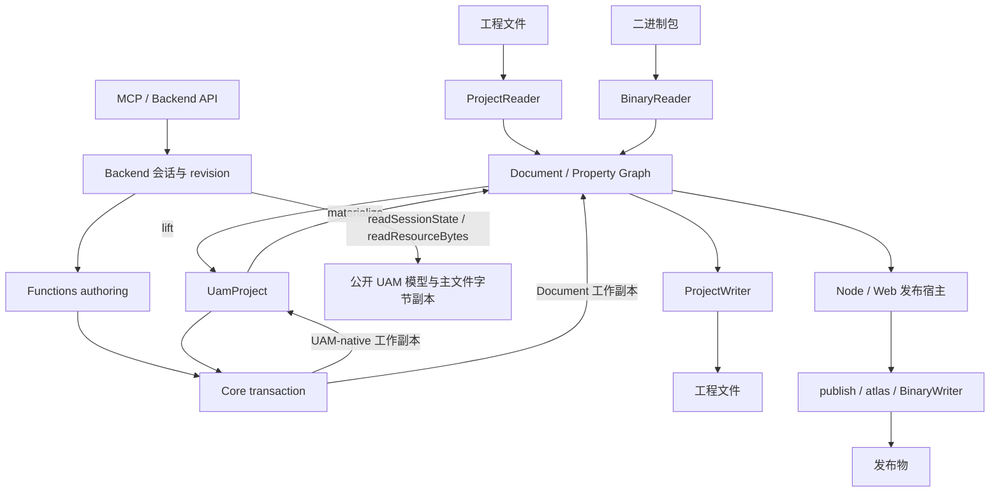

# OpenFairyGUI 架构总览

本页只说明职责、事实源、数据流与安全边界。安装、术语、参考语料和验证命令见[开发指南](./guide/development.md)，具体修改起点见[任务指引](./guide/task-recipes.md)。字段、默认值和操作目录由各自的正式文档维护，不在总览复制。

## 结论

UAM 是公开的声明式 authoring 契约；`Document + Property Graph` 是 Core 内部的物化、协议适配与执行表示。已有工程文件仍是导入时的事实来源，不能通过手工 lift 后重新导入 UAM 来绕过源文件保真检查。

Core 拥有事务语义，Functions 组合工作流，Backend 管理会话状态与保存，CLI/MCP 只做入口适配。可读取、可物化、可编辑、可保存和可发布是不同能力；查询或预演成功不授予后续写入权限，也不保证保存或发布成功。

Core 的正式 UAM 保留组件实例 controller 覆盖及 Gear 默认值缺省语义。Functions 在发布筛选前按资源分支读取位图字体，建立图像依赖；Core 编码字体名称、字形与发布 ID。代码生成名称分配归 Functions，MCP 不参与协议补齐。

Backend 预演只在内存中物化可能含无效引用的已有快照，以支持修复事务的文件差异比较；结果状态和保存入口仍严格校验。MCP 仅按生成契约的字节路径应用合计 8 MiB 的二进制输入预算，其他 JSON 继续使用通用结构预算。

## 模块边界与事实源

| 模块 | 拥有的职责与修改入口 | 不拥有的职责 |
|---|---|---|
| Core | `packages/core/src/uam/model.ts`、`transaction-contracts.ts`、`transaction.ts`：UAM 与事务；`properties/`：正式属性；`io/`：XML、二进制和平台 I/O | 会话、传输协议、高层发布/恢复策略 |
| Functions | `packages/functions/src/uam-transaction.ts`：结构化无状态事务结果；`validate.ts`、`publish.ts`、`restore.ts`、`atlas.ts`：工作流 | 第二套 selector / operation grammar，authoring 隐式触发发布/恢复 |
| Backend | `packages/backend/src/runtime.ts`：装配；`runtime/contracts.ts`：方法签名；`runtime/capabilities.ts`：能力；`services/`：read / authoring / artifact / runtime；`storage.ts`：存储适配 | Core 语义、MCP 传输、在 browser-safe 会话中执行发布/恢复 |
| MCP | `packages/mcp/src/tool-metadata.ts`、`tool-handler.ts`：方法映射、传输注解、宿主字段排除和预算；resources / prompts / stdio | 事务内核、路径授权、自动修复、artifact 执行权 |
| CLI | `packages/cli/src/cli.ts`、`commands/`：参数与调用装配；`contracts.ts`、`utils/json-output.ts`：进程 JSON envelope | 领域协议；工作流 result 仍复用 Core/Functions/Backend 类型 |
| codegen（`@openfairygui/codegen`） | `packages/codegen/src/*.ts`：零运行时依赖的通用模板基础设施——严格模板渲染、C# 命名与路径工具、稳定哈希，以及可注入文件系统的 overwrite/preserve 写入策略 | FairyGUI 中间模型、框架模板、目录布局与发布工作流 |
| et-fui-codegen 插件（`plugins/et-fui-codegen`） | Node publish 插件：FairyGUI `Document` → ET 模型映射、ET C# 模板与输出目录布局，运行时依赖 `@openfairygui/codegen` 的通用能力 | 通用 engine / naming / hash / writer（下沉至 `@openfairygui/codegen`） |
| test-utils | `packages/test-utils/`：测试辅助和固定提交的 fixture | 生产协议或运行时工作流 |

`scripts/generate-contracts.mjs` 用已有 TypeScript 编译器从 Core/Backend/CLI 类型生成结构 schema、操作目录、版本绑定语料及文档表格；MCP 复用现有 Zod 校验结构，Core 再校验语义。独立的 `@openfairygui/backend/docs` 分发生成数据，不引入 Backend → CLI 的运行时依赖，也不让 Core 依赖 Zod。

生成入口负责契约组装和命令参数；`scripts/contracts/schema.mjs` 拥有类型程序与 schema 推导，`transport.mjs` 拥有输入预算和字节路径，`output.mjs` 拥有双语表格、安装文档及生成漂移检查。

Backend 的带类型诊断目录覆盖正式错误码，记录共享码的全部 owners、文档 URI 和恢复建议；响应保留实际来源与原错误字段。CLI/MCP 共用随安装版本发布的离线语料与薄 Skill。精确字段、版本和摘要见[契约查询](./guide/contracts.md)、[诊断与恢复](./guide/diagnostics.md)、[安装版本文档](./guide/installed-docs.md)。

MCP 的工具发现与分发由 SDK 管理，Host 可通过公开 `registerTool()` 在同一 server 添加工具。`toolPolicies` 在输入校验后、Backend 调用前运行 Host 检查；已声明的 Host 失败分支终止调用，放行则用原输入调用 Backend 一次。授权及 grant 消费归 Host，revision、路径和写盘保护仍归 Backend。工具发现保持有界 `$ref` schema；Host 输出扩展不修改随包 Backend 契约或文档。

## 当前最关键的数据流

```mermaid
flowchart TD
    SOURCE["工程文件"] --> READER["ProjectReader"] --> DOC["Document / Property Graph"]
    BINARY["二进制包"] --> BR["BinaryReader"] --> DOC
    DOC -->|lift| UAM["UamProject"]
    UAM -->|materialize| DOC
    MCP["MCP / Backend API"] --> SESSION["Backend 会话与 revision"]
    SESSION --> APP["Functions authoring"] --> TX["Core transaction"]
    SESSION -->|readSessionState / readResourceBytes| READ["公开 UAM 模型与主文件字节副本"]
    UAM --> TX
    TX -->|UAM-native 工作副本| UAM
    TX -->|Document 工作副本| DOC
    DOC --> WRITER["ProjectWriter"] --> OUTPUT["工程文件"]
    DOC --> HOST["Node / Web 发布宿主"] --> PUBLISH["publish / atlas / BinaryWriter"] --> ART["发布物"]
```

`bridge.ts` 保持 lift/materialize 门面；实现分别位于 `bridge-lift.ts`、`bridge-materialize.ts`、`bridge-shared.ts`，受控源文件枚举归 `project-source-files.ts`。二进制使用 `Uint8Array`，转换和事务工作副本保留字节，不经过 JSON clone。

Gear 字符串解析归 `bridge-lift.ts`；具体属性的 Document setter 映射归 `bridge-materialize.ts`，创建与事务更新复用同一映射。Document 的日志依赖直接指向 logger 叶模块。XML 读写按具体标签协议调用一次共有状态 handler，标签分支只处理其余专属字段；共有状态在 Gear 默认值捕获之前读取，不改变正式属性的标签归属。

`display-object-xml-reader.ts` 保留标签分发与共有状态读取；同目录的 `display-object-xml-text.ts`、`display-object-xml-list.ts`、`display-object-xml-behaviors.ts`、`display-object-xml-instance.ts` 分别拥有文本、列表、Gear/relation、实例覆盖。执行顺序为专属属性 → 共有状态 → Gear → relation → property 覆盖 → 扩展覆盖；共享 XML 形状和属性覆盖解析位于 `display-object-xml-shared.ts`。

ProjectReader 保持工程设置、主包与分支、分支关联、组件第二遍解析的全局顺序。`project-reader-discovery.ts` 分离目录探测结果与可选目录/文件探测的诊断策略，不创建资源；`project-package-reader.ts` 读取包描述、目录元数据并登记资源；`project-resource-hydration.ts` 负责图像尺寸、源字节和 MovieClip 派生数据；`project-component-xml-validation.ts` 只检查组件 XML 属性值。共享 XML 节点提取与语法检查归 `utils/xml-utils.ts`。入口仍拥有读取错误分类和完整性判定，组件解析始终在全部资源登记之后执行。

XML 写入的共有格式化、协议辅助和 property 覆盖节点序列化位于 `project-xml-writer-utils.ts`。`display-object-xml-text-writer.ts` 使用 `GTextField`、`GTextInput` 写出文本与输入框属性；`display-object-xml-list-writer.ts` 使用 `GList`、`GTree` 写出列表属性和条目；`display-object-xml-instance-writer.ts` 使用 `GComponent` 写出实例引用、property 覆盖及扩展数据。条目和属性覆盖复用正式模型类型。`display-object-xml-behaviors-writer.ts` 拥有 Gear 值格式化、标签允许项筛选和 relation 分组序列化，其 Gear 校验由工程写入前检查和显示列表输出共同调用。`display-object-xml-writer.ts` 保留标签分发、图片/图形/Loader 等具体类型序列化函数、共有状态和节点顺序编排；共有状态接口仅将部分标签缺少的状态 getter 设为可选，不承载控件专属属性；列表条目与实例 property 覆盖先于 Gear/relation，实例扩展节点由入口最后追加。

ProjectWriter 在写盘前构建一次包/分支输出描述，固定描述文件、资源文件与文件夹目标，以及描述文件中的资源排序。目标冲突检查和保存共用这份描述；组件与源字节仍按原有顺序逐项写入，不缓存整份工程的序列化字节。全部包写入成功后，清理阶段重新核对实际路径身份，保护仍被当前输出占用的旧路径。

工程读取、UAM 检查与源数据验证分层：`readProjectDetailed` 报告读取完整性，`validateUamProject` 检查模型，Functions 组合为正式验证报告。`invalid` 是确定错误，`incomplete` 是能力或数据不足；详见[工程验证](./project-validation.md)。

## 事务与预校验

稳定入口为 `packages/core/src/uam/transaction.ts`。`validateTransactionSupport(project)` 检查全项目支持范围；传入 operations 时按触及范围、批次顺序和最终引用检查。支持检查不是完整执行预演。

`transaction-preflight.ts` 保留逐操作分发和阶段顺序，领域实现位于 `packages/core/src/uam/preflight/`：

| 文件 | 不变量 |
|---|---|
| `support.ts`、`values.ts` | 支持范围、selector、诊断构造、共享值与安全名称校验 |
| `settings.ts` | 工程/包设置快照、JSON-safe 值及规范比较 |
| `display.ts` | 节点类型对应的属性快照与无变化判定 |
| `behaviors.ts` | controller、transition 与 gear 的页面、目标和同批绑定关系 |
| `resources.ts`、`resource-folders.ts` | 资源源字节、PNG/JPEG/JTA、目录与 atlas 约束 |
| `lifecycle.ts` | 在同一工作副本中按顺序投影分支、包、组件、资源、目录及显示列表重写 |
| `projected-state.ts` | 最终 group / 资源引用，以及未触及的既有问题边界 |

生命周期投影复用实际 UAM apply helper，不另建执行器。领域函数不能各自遍历并重排整个批次；错误码、路径、诊断顺序与失败不修改输入必须保持。`uam-transaction-support.test.ts`、`uam-transaction-apply.test.ts`、`uam-transaction-lifecycle.test.ts` 覆盖这些职责和跨域批次。

执行按现有操作能力进入 `transaction-uam-apply.ts` 或 `transaction-document-apply.ts`，失败丢弃私有工作副本，成功返回新的规范 UAM。物化支持范围不等于任意字段 mutation；原子生命周期批次也不是任意 operation 的自由组合。精确语法、支持范围与查询入口见[契约指南](./guide/contracts.md)。

`uam/property-rules/` 按文本、图片与 MovieClip、组件实例划分共用属性规则，检查完整快照的结构、数值范围和局部一致性；全项目校验与显示事务预检直接复用。`validate.ts` 保留工程遍历、全局引用与诊断顺序，事务预检保留 selector、当前状态和操作支持范围。列表、Loader 等事务专用约束仍由预检拥有，不扩大为既有工程读取限制。

`property-updates.ts` 是显示属性更新规则的共同实现，供预校验投影和两条执行路径复用。Document 路径读取目标节点的 UAM 属性、应用更新后，通过 bridge 写回原对象，保留 Gear 与 Controller 的对象绑定。Controller payload 校验由有序预校验拥有，执行器解析当前引用；Controller 创建和 Gear 类型映射复用 bridge。`uam-transaction-parity.test.ts` 通过净效果为空的 Controller 批次触发 Document 路径，比较共同操作的结果、诊断和输入不变性。

## Backend 会话与保存

现有文件工程用 `openSession`：获取覆盖会话生命周期的锁、水合资源字节，并比较原 Document 与 UAM 往返后的完整 ProjectWriter 输出。未建模的写回差异标记为 `uamFidelity: unsupported`，实际写入会拒绝。只有调用方 UAM 本身就是事实来源时，才用 `openProjectSession` 与 `materializeSession` 建立新 workspace。

纯内存会话的 `canonicalProjectPath` / `canonicalPathKey` 仅标识会话。保存和物化使用会话已绑定的存储或宿主本次显式提供的适配器，不自动取得 runtime 全局文件系统；预演也按实际绑定情况报告保存能力。

| 操作 | 状态与副作用 |
|---|---|
| `queryEntity` | 七类固定投影：project、package、resource、component、displayNode、controller、transition；工程无需 selector，其余精确选择；返回实际 revision，脱离会话且有界，不含源字节 |
| `readSessionState` / `readResourceBytes` | 同步捕获当前已提交模型与单资源主文件字节，返回独立副本与实际编辑 revision；资源读取必须核对模型 revision，不重新水合、不修复、不写入 |
| `preflightTransaction` | 同一会话队列检查 revision，复制工程/字节并执行后丢弃；不改工程、dirty、revision、缓存或业务事件，不写盘 |
| `applyTransaction` | 再次检查 expectedRevision；成功替换会话工程，revision 加一并标 dirty；失败保留工程与 revision，可发出拒绝事件 |
| `saveSession` | 用会话绑定的文件系统保存；成功才更新 lastSavedRevision、清 dirty 与待清理路径；不推进编辑 revision |
| `materializeSession` | 显式目标和适配器下的完整首次写回；保留路径、保真与验证门禁，不用它绕过 dirty 保存 |
| `closeSession` | 排在此前事务/写入之后释放锁；不自动保存未提交工作 |

项目与包设置查询复用 `ReadService` 的固定投影、JSON 预算检查和深度复制，返回身份与完整 `settings`。调用方只修改所需字段，再把完整设置及查询 revision 交给既有 `updateProjectSettings` / `updatePackageSettings` 事务；MCP 直接映射此查询和事务链路。

完整状态读取同样归 `ReadService`，直接派生公开 UAM 模型、排除 asset resource 主文件 `sourceBytes`，通过另一读取方法提供已有字节。模型保留 sourcePath 与 JSON 扩展数据；源读取完整性、诊断及保真标记如实返回，不等价于字节齐全或下游能力承诺。两次读取之间的编辑会导致 `stale_read`，调用方重新开始，不引入历史快照、租约或 Viewer 逻辑。保存可在同一编辑 revision 更新 sourcePath 和 dirty，因此完整原始 UAM 不由 revision 永久唯一标识。Backend 限制模型与原始字节；MCP 独立限制新工具完整响应，并仅对完整读取模型使用可扩展的输出对象 schema。详见[会话读取契约](./guide/contracts.md#读取当前会话模型与资源字节)。

预演比较两份正式 UAM 得到实体/字段影响，并复用内存捕获文件系统与 ProjectWriter 得到工程相对文件/目录差异。它反映当前 revision 到预演结果，不是上次保存以来的累计差异、磁盘写入清单或删除授权。摘要超预算时完整拒绝，不截断为成功；保存提示的 `writeVerified` 始终 false，projected revision 不被预留。详见[事务预演](./guide/contracts.md#预演一次事务)。

`SessionOperationQueue` 串行化同一会话的预演、提交、保存、物化和关闭，不阻塞其他会话。`SessionRegistry` 独占会话与路径索引：打开工程和物化到新存储在异步 I/O 前预占目标，成功后提交绑定，失败只释放自己的预占。重新绑定失败保留原绑定；宿主提供的跨运行时锁和存储事务仍负责各自边界。

排队前复制保存、物化和关闭的请求值；存储适配器保持原对象身份。UAM 规范化独立持有 Gear 状态值、资源元数据和源字节。目录枚举失败产生不完整读取，文件会话不能将其当作完整 UAM 写回。已持有文件锁的会话拒绝改绑存储；`closeSession` 释放锁失败返回 `session_close_failed`，保留会话和锁记录，修正故障后可重试关闭。Node 仅将锁文件不存在视为已释放；锁元数据读取失败、损坏或 token 不匹配都会报错并保留锁文件。

`ReadService` 只接收包含嵌套只读 UAM 的会话视图，检查响应预算后返回脱离会话的数据；`AuthoringService` 只持有事务所需的会话查询、缓存/事件命令与队列。`RuntimeService` 负责打开和关闭，`PersistenceService` 负责保存和物化，实际工程写入复用 `session-project-writer.ts`。`EventService` 和 `CacheService` 分别独占事件序列/日志和缓存集合，只查询各自所需的会话字段。

事件是有界轮询日志；cache 按 sessionId 保存 revision-bound 派生数据，不是事实源。`refreshCache` 同步计算计数、发送一次 `cache.updated` 并直接返回 `BackendCacheSnapshot`，不改变编辑或保存 revision。Backend 契约版本为 `3.0.0`，能力 schema 为 `12`。artifact plane 只声明宿主能力，不执行 publish/restore。

保存与物化共用 PersistenceService 内部的成功完成步骤：更新 saved revision、清除 dirty、刷新 cache，然后依次发送 `save.completed` 与 `cache.updated`。前置校验、存储绑定和错误结果保留在各自路径，两条路径仍由同一个会话队列串行化。

## Node / Web 与路径边界

- Core、Backend 根入口保持 browser-safe；平台 I/O 从 `@openfairygui/core/node` 或 `/web` 获取，仅需适配器类型时用 `/project-io`。`@openfairygui/functions/uam` 是 Backend 浏览器入口所用的窄事务工作流。
- Node 默认装配位于 `packages/backend/src/node.ts`。打开前拒绝工程树中的符号链接，每次路径操作还检查最近存在祖先的 realpath；allowed roots 由 Backend 执行，MCP roots 不授予权限。
- Node 持久锁只自动回收同主机且能确认 owner 已失效/PID 复用的有效记录；损坏、跨主机或活跃锁仍冲突。保存使用同级 staging、backup 与目录切换；提交失败时尝试恢复原树。`ProjectWriteTransactionError` 明确报告磁盘状态；只有确认原树未改变或已恢复时才报告 `diskMayBePartiallyUpdated: false`。回滚也失败时保留备份和暂存目录，并在保存错误的 `recoveryPaths` 中返回它们。
- 浏览器通过 `createBackendStorageFileSystem` 注入异步存储，提供 `unlink` 和非递归 `rmdir`。Web Locks 原子排斥活跃标签，刷新/终止由浏览器释放；无 Web Locks 时须注入等价租约。持久锁文件不是浏览器锁事实源。
- 通用浏览器适配器不自动获得 Node 的原子保存语义；未提供 `runProjectWriteTransaction` 时不声明 `atomicSave`。旧源文件与空目录仅在新的工程写入全部完成后按受控清单清理。
- 浏览器图片替换通过异步事务与公开 `@openfairygui/core/image-validation-worker` 入口进行严格验证；宿主须将 worker 及其依赖打成相邻的独立 ESM 文件。同步 browser 入口拒绝图片替换；MovieClip 使用同一 JTA 解析路径。

`@openfairygui/core/web` 只提供工程树读写，不包含二进制 I/O、会话、发布或恢复。OPFS / 用户 Folder 的存储权限由浏览器宿主处理。可运行接法及 worker 打包要求见[包入口](./guide/packages.md)与[浏览器示例](./guide/examples.md#真实浏览器存储)。

## Publish / Restore 宿主边界

`packages/functions/src/publish.ts` 编排设置、资源闭包、atlas、二进制与代码生成；选项/资源域归 `publish/`，packing 与 JTA/FNT codec 归 `atlas/`。Node/Web 复用主链，不从 Backend 会话隐式启动。

每次调用在现有包发布计划中持有独立的 `PackagePublishContext`：资源选择、有效 ID、外部文件名和分支策略由 `publish/package-context.ts` 计算，外部资源写出直接读取上下文，Atlas 接收按资源身份建立的选择/ID 映射。Core 定义窄输入 `BinaryPackageEncodingContext`，由 `BinaryWriterOptions.packageContext` 传入；组件编码只接收本包 ID 和有效资源 ID 映射。发布阶段不把这些派生状态写入包或资源的 `extras`，也不复制 Document。高分辨率关联、像素命中数据和 Atlas/Sprite 仍按发布阶段更新正式模型。

单独调用 BinaryWriter 并省略上下文时，使用当前模型的全部可编码资源、正式 ID 和分支，外部字体仍按既有规则排除。BinaryReader 的原始二进制切片、sprite 数据和文件名元数据仍用于二进制往返；显式上下文中的文件名只覆盖本次编码，不替换源元数据。

代码生成入口 `codegen.ts` 负责插件与包级编排；`codegen-settings.ts` 解析设置与输出计划，`codegen-model.ts` 构建命名及成员模型，`codegen-render.ts` 只渲染文件名和文本，`codegen-output.ts` 统一执行包目录清理与顺序写入。

- `publishNode()` 注入 Node 文件系统、Sharp 和工程插件；显式 output 使用同级 staging 后提交，拒绝既有输出中的符号链接。返回文件清单来自本次实际写入与 atlas 完成记录，不枚举旧目录推测。
- `publishBrowser()` 注入调用方文件系统、Canvas raster adapter 和空 hooks；不支持的设置在写入前拒绝。输出原子性由宿主负责，失败清单仅包含已完成的写入。
- `restoreNode()` 只从可信本地发布目录恢复到独立工程目录，复用 `restore.ts` 与 `restore-internals/` 的路径检查、重建和输出事务。它不保证恢复原 XML、编辑器设置、未发布内容或本地状态，也不判定未知输入是否可信。

`restore.ts` 保持准备、写出与提交的阶段顺序。`restore-internals/resource-paths.ts` 拥有受控文件定位和输出路径，复用 `path-utils.ts` 的资源路径校验；`skeleton.ts` 拥有骨骼类型修复、附属资源与依赖关联；`asset-output.ts` 拥有图集裁剪、生成文件及 loose 文件输出。字体与 MovieClip 分别复用 `font.ts`、`movie-clip.ts`，资源参数使用 Core 的具体类型。

图集生成成功后替换该包的旧 Atlas/Sprite；生成失败移除本次新节点，保留之前完整的图集。发布资源选择只依据正式资源导出状态和依赖，不让先前生成的 Sprite 扩大下一次发布集合。ProjectWriter 在首次写盘前验证所有包和分支的图片排序提示；清理旧文件和目录时使用适配器的真实路径身份，避免大小写别名指向当前输出。

图片序列化提示由 Core 的 `ProjectWriter.setImageWriteHints()` 拥有，按图片对象身份保存，不进入属性模型或 `extras`。`omitPackageSize` 控制推导尺寸省略，`packageOrder: { afterId, weight }` 控制写出顺序；目标必须是同包、同分支且未设置排序提示的资源，空 ID 表示放到末尾，同组按有限权重和资源 ID 排序，无效目标会拒绝写入。Restore 的字体纹理和字形共用这一契约；占位字形图像由 Functions 内部按对象身份记录，Writer 不识别字体恢复专用标记。设置提示会复制并替换原提示；返回的同一 `Document` 交给新的 Writer 时仍生效，空提示恢复普通写入。提示不跨 UAM 转换、重新读取或资源对象替换传播。

CLI 只解析参数、调用正式 Node 入口并包装结果。产品 MCP 不提供 publish/restore 执行工具；评测中的独立 artifact 宿主使用固定输入/目录的受限工具，不扩大产品权限。

## 协议与行为细节索引

| 需要确认的事实 | 正式文档 |
|---|---|
| XML 属性、结构节点与 displayList variants | [属性协议](./project-xml-attribute-reference.md)、[DisplayList 标签](./project-xml-displaylist-variants.md)；元数据实现为 `packages/core/src/io/project-xml-protocol.ts` |
| sidecar、资源/文件夹、分支目录、图片/JTA、发布设置与写回 | [编辑器发布设置](./editor-publish-settings.md) |
| 二进制 block、资源编码、附属文件命名、高分辨率与分支发布 | [二进制包协议](./fairygui-binary-package-format.md)、[发布设置](./editor-publish-settings.md) |
| 完整性、解码能力与安全失败 | [工程验证](./project-validation.md)、[诊断](./guide/diagnostics.md) |
| 发布插件与受限恢复 | [插件边界](./publish-plugins.md)、[恢复限制](./published-project-restore-limitations.md) |

## 契约与消费者验证

`agent/impact-map.json` 驱动变更测试与 AGENTS 指引表；`check:ci` 组合完整测试、契约/文档检查、文档构建和仓库外五包安装消费者。发布前检查将要发布的同一组 tarball，不用 workspace 链接替代。

`scripts/consumer/helpers.mjs` 拥有消费者共用的文件边界、公开导出、bin、CLI 信封和目录快照检查；各验收场景及仓库自测直接依赖该叶模块。隔离消费者拷贝清单和 Agent 评测 harness 摘要都包含它，共用 helper 不从 runtime 场景入口导入。

消费者运行公开 Node / MCP stdio 示例，并在真实 Chromium 中执行 OPFS → Core adapter → Backend session → 预演/编辑/保存 → WebIO 水合回读；验证源字节、Web Locks、刷新恢复与路径拒绝。它不代表用户 Folder 交互授权、渲染器或所有浏览器已经验证。

十个真实消费者评测涵盖读取、精确编辑、并发恢复、保留未保存工作的安全停止及独立发布/恢复。reference 是确定性门禁，真实模型结果是手动观察，两者分别记录，不能相互冒充。任务、历史证据与限制见[Agent 评测](./guide/agent-evaluations.md)。

仓库 doctor 检查开发版本、依赖/导出、参考资料、原生 PNG/JPEG 编解码及临时目录；产品 doctor 检查安装环境、原生编解码、临时/显式输出目录，并可验证显式工程。两者都不安装、不创建会话/锁/探针、不运行插件或发布/恢复，访问检查不证明后续写入或回滚。具体覆盖见[开发验证](./guide/development.md)和[安装版本诊断](./guide/installed-docs.md)。
