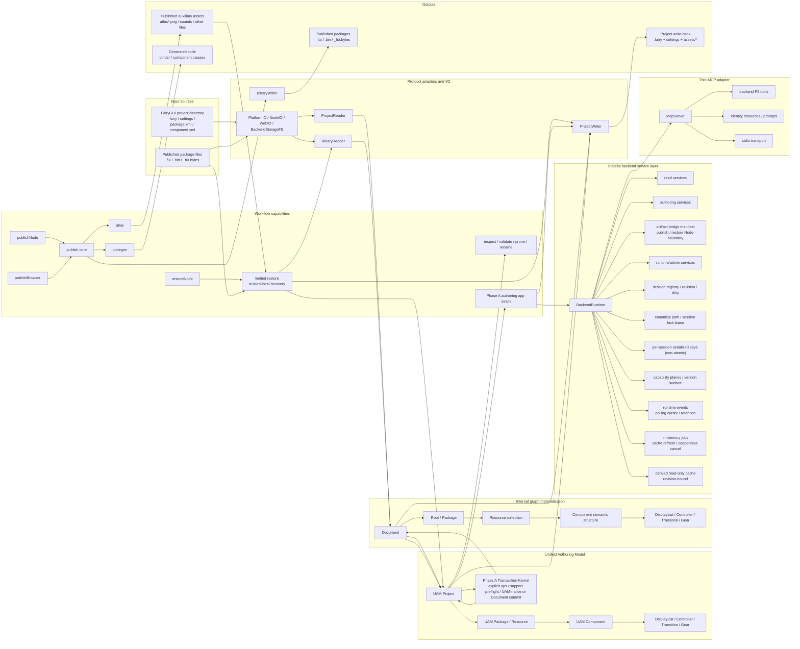
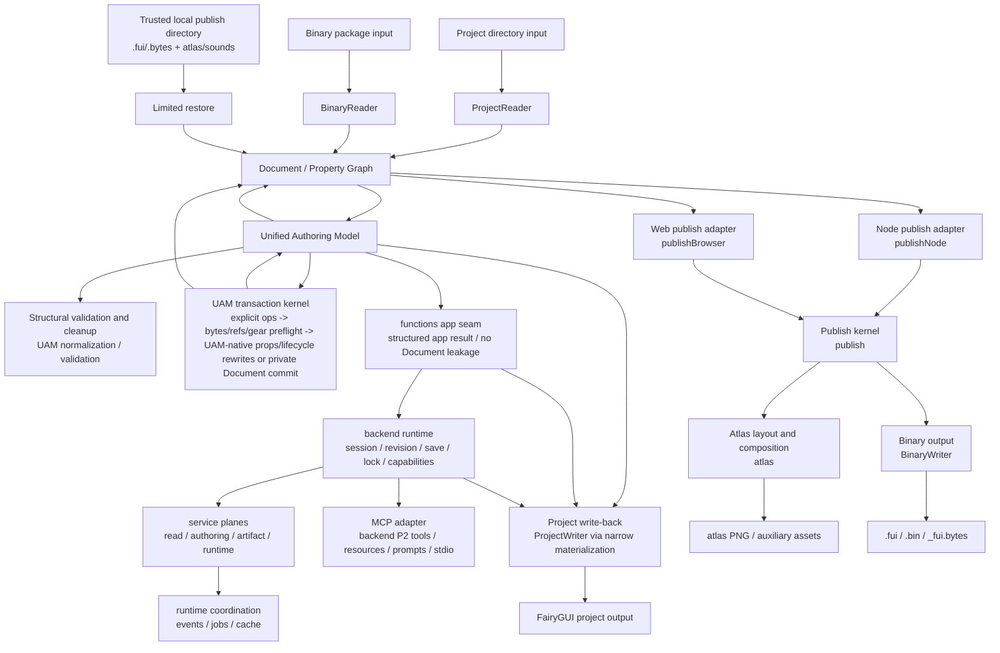

# OpenFairyGUI Architecture Overview

## Summary

At **Gate A**, the repository is best understood as a seven-stage structure: `input sources -> protocol adapters -> Unified Authoring Model -> internal graph materialization -> workflows / backend runtime -> thin MCP adapter -> outputs`.

The new primary source of truth is the **Unified Authoring Model (UAM)**. `Document + Property Graph` still exists, and most established workflows still operate around it, but it is now an internal execution, storage, and adaptation layer rather than the long-term public authoring center.

Two important backend seams are also present:

- the Phase A **UAM-public / Document-private** authoring transaction seam;
- the stateful `backend` runtime and service layer built on that seam.

## Key details

| Layer | Current responsibility | Key files |
|---|---|---|
| Entry | CLI registration, argument parsing, and workflow assembly | `packages/cli/src/cli.ts`, `packages/cli/src/commands/*.ts`, `packages/cli/src/utils/*.ts` |
| Protocol adapters | Abstract platform filesystem differences and handle project formats, binary formats, and Project XML protocol metadata. The project facade only coordinates package/project work; component/display XML and component binary blocks are handled by internal domain modules. | `packages/core/src/io/file-system.ts`, `packages/core/src/io/project-io-contracts.ts`, `packages/core/src/io/platform-io.ts`, `packages/core/src/io/node-io.ts`, `packages/core/src/io/web-io.ts`, `packages/core/src/io/project-xml-protocol.ts`, `packages/core/src/io/project-reader.ts`, `packages/core/src/io/project-writer.ts`, `packages/core/src/io/component-xml-*.ts`, `packages/core/src/io/display-object-xml-*.ts`, `packages/core/src/io/binary-reader.ts`, `packages/core/src/io/component-decoder*.ts`, `packages/core/src/io/component-encoder*.ts` |
| UAM source of truth | Unified declarative project-level authoring model for `project / package / resource / component internals` and behavioral semantics, with the public Phase A transaction kernel | `packages/core/src/uam/*.ts` |
| Internal graph materialization | `Document` owns the `Property Graph` used for current internal execution, storage, adaptation, and reuse by established workflows | `packages/core/src/document.ts`, `packages/core/src/properties/property.ts` |
| Project skeleton | `Root -> Package -> Resource -> Component` forms the base structure | `packages/core/src/properties/root.ts`, `packages/core/src/properties/package.ts`, `packages/core/src/properties/component.ts` |
| Workflows | Composable automation pipelines and a thin authoring app seam built on the core Phase A transaction contract. Publish, atlas, and restore facades retain only orchestration; option resolution, package context, external resources, packing, codecs, and output transactions live in their internal domain modules. | `packages/functions/src/inspect.ts`, `packages/functions/src/validate.ts`, `packages/functions/src/prune.ts`, `packages/functions/src/rename.ts`, `packages/functions/src/publish.ts`, `packages/functions/src/publish/*.ts`, `packages/functions/src/adapters/node/*.ts`, `packages/functions/src/adapters/web/*.ts`, `packages/functions/src/node.ts`, `packages/functions/src/web.ts`, `packages/functions/src/restore.ts`, `packages/functions/src/restore-internals/*.ts`, `packages/functions/src/atlas.ts`, `packages/functions/src/atlas/*.ts`, `packages/functions/src/codegen.ts`, `packages/functions/src/uam-transaction.ts` |
| Stateful backend services | Browser-safe project sessions, browser-safe async project storage adapters, adapter-backed file sessions, revision/dirty tracking, backend-local canonical paths and session lock leases, coordinated saves, capability planes and manifests, version surface, runtime events, in-memory jobs, derived read-only cache, and `read / authoring / artifact / runtime` service stratification | `packages/backend/src/runtime.ts`, `packages/backend/src/runtime/contracts.ts`, `packages/backend/src/runtime/capabilities.ts`, `packages/backend/src/storage.ts`, `packages/backend/src/node.ts`, `packages/backend/src/contracts.ts`, `packages/backend/src/path-policy.ts`, `packages/backend/src/services/*.ts` |
| Thin MCP adapter | Maps all backend P2 methods to MCP tools; supplies stdio transport, MCP tool output schemas, identity resources, and guidance prompts without redefining UAM or backend semantics | `packages/mcp/src/server.ts`, `packages/mcp/src/tool-definitions.ts`, `packages/mcp/src/tool-handler.ts`, `packages/mcp/src/resource-definitions.ts`, `packages/mcp/src/prompt-definitions.ts`, `packages/mcp/src/stdio.ts` |
| Output | Project write-back, atlas generation, binary package output, and generated code | `packages/core/src/io/project-writer.ts`, `packages/functions/src/atlas.ts`, `packages/core/src/io/binary-writer.ts`, `packages/functions/src/codegen.ts` |

Additional details:

- `@openfairygui/core` currently contains both the UAM source-of-truth layer and the internal graph-materialization layer.
- The materialization scope in `packages/core/src/uam/model.ts` covers every current display node class: `GImage`, `GTextField`, `GRichTextField`, `GTextInput`, `GComponent`, `GList`, `GTree`, `GGraph`, `GGroup`, `GLoader`, `GLoader3D`, `GMovieClip`, `GButton`, `GLabel`, `GComboBox`, `GProgressBar`, `GSlider`, and `GScrollBar`. `UamDisplayNodeBase` formally owns common properties such as position, size, lock state, width/height constraints, min/max size, pivot, scale, skew, visibility, tooltip, blend mode, and filters. Complete root properties for component definitions live in `component.properties`; specific extension overrides for `GComponent` reference nodes live in `instanceProperties`; ordered property overrides for component instances and static list items live in their respective `propertyOverrides`; and `autoClearItems` for List/Tree and ComboBox remains a formal property of the corresponding type. Image resources, MovieClip resources, and text objects use complete property snapshots for their formal project attributes. `UamMovieClipResource.movieClip` contains `interval / repeatDelay / swing / smoothing / frames`, and each frame snapshot contains its rectangle, additional delay, and sprite ID. The old generic `metadata` property bag is not supported. `group` exists only on display nodes whose protocol supports it; `GLoader / GLoader3D` do not carry that reference. These concrete properties are not stored in long-lived `extras` or a generic `metadata` bag.
- `packages/core/src/uam/transaction-contracts.ts` owns the public selector, operation, support-issue, and transaction-error contracts. `transaction.ts` is the stable facade; support preflight, UAM-native apply, Document-backed apply, and shared lookup logic live in `transaction-preflight.ts`, `transaction-uam-apply.ts`, `transaction-document-apply.ts`, and `transaction-shared.ts`. `commit()` returns a new normalized `UamProject`. Pure `setComponentProps`, `setDisplayNodeProps`, `setImageResourceProps`, idempotent `setResourceFavorite` / `setResourceFolderFavorite` / `setResourceExported`, package/component/binary-resource and empty-resource-folder lifecycle transactions, and mixed lifecycle batches with `attachDisplayNode` / `detachDisplayNode` reference rewrites execute directly on UAM. Preflight validates group, resource, and component references against the final projected state, so resource copy, nested-component copy, reference rewrite, and component move can commit atomically in one batch. Untouched complex nodes, references, relations, and transitions remain as lossless passthrough data. Other resource, structure, and gear transactions execute through a private `Document` working copy that is discarded completely on failure.
- `setResourceFolderAtlas` is a public UAM-native transaction that updates only the source Atlas slot of the folder selected by canonical `branch + path`. It shares preflight with `addResourceFolder.atlas`: an empty string clears the override, while a non-empty value must be a canonical decimal slot no greater than the effective `maxAtlasIndex`; the limit defaults to `10` when package publish settings are absent. Assigning the current value is rejected as `resource_folder_atlas_unchanged`. A transaction may first expand the slot range with `updatePackageSettings` and then submit the folder Atlas operation; preflight reads projected settings in operation order.
- `packages/core/src/uam/bridge.ts` is the stable facade between UAM and the internal `Document`; lift, materialize, shared conversion, and project source-file enumeration live in `bridge-lift.ts`, `bridge-materialize.ts`, `bridge-shared.ts`, and `project-source-files.ts`. Weak references that a real project can save but that do not necessarily resolve in the current resource graph pass through according to Project XML semantics: an empty relation target means the component container, display resource refs may remain dangling or cross-package, and transition item targets and display gear pages may preserve legacy editor data. `validateUamProject` blocks only hard structural errors that would break current materialization or write-back.
- `ProjectReader.read(path, { hydrateResourceBytes: true })` is the explicit source-byte hydration entry. It attaches primary source bytes to image, sound, misc, font, MovieClip, Spine, and DragonBones resources in main and branch packages, and rejects resource paths containing traversal in XML. A parseable PNG IHDR or JPEG SOF header with valid fields is the source of truth for raster image dimensions and overrides stale XML dimensions. Batch hydration does not scan complete containers or decode pixels; only `replaceResourceBytes` preflight performs PNG CRC/zlib/scanline validation and strict JPEG pixel validation. Unsupported formats such as SVG retain their project-declared dimensions. Node/CLI synchronization limits source or decoded PNG bytes to 128 MiB, while strict JPEG decoding is additionally limited to 8,388,608 pixels and 64 MiB. Supported JTA v100-v102 MovieClips derive bounds, playback interval, repeat delay, swing, and frame rectangles/delays completely from the same source bytes; JTA source bytes are the canonical source of truth for those fields. The `MovieClipResource` frame list is rebuilt atomically only after parsing completes, and XML-owned `smoothing` is not overwritten by JTA. Unsupported or unreadable JTA still retains its raw source bytes and XML model during hydration. The UAM bridge copies `Uint8Array` values during lift/materialize instead of carrying binary data through JSON cloning.
  - UAM materialization scope and transaction scope are separate capability planes. Complete display-node lift/materialize support does not mean `UamTransactionOperation` exposes every field of every node kind for mutation. The current transaction scope covers complete project-settings snapshots, complete package-descriptor and publish-settings snapshots, safe branch-registry add/rename/remove, component size/root-property snapshots, component-reference instance-extension overrides, rename/move/favorite/exported settings for modeled resources, favorite settings and add/rename/move/remove for empty resource folders, complete image-resource and text-object property snapshots, formal group references, binary-resource add/replace/remove, common display properties (position, size, lock state, width/height constraints, min/max size, pivot, scale, skew, visibility, tooltip, blend mode, filters, and custom data), complete `groupProperties` snapshots for `GGroup`, attach/detach, controller, transition, and add/update/remove for `display`, `display2`, `look`, `xy`, `size`, `color`, `animation`, `text`, `icon`, and `fontSize` gears. It still does not expose panel-style arbitrary editing for display lists, controllers, or transitions. `setDisplayNodeProps` projects target nodes in operation order and rejects an identical property result as `display_node_props_unchanged`. `updateProjectSettings` requires JSON-safe values and finite numbers during preflight, validates all formal fields, copies the complete snapshot on apply, preserves unknown JSON-safe keys, and rejects an identical normalized snapshot as `project_settings_unchanged`. When optional i18n or custom-property settings are removed, ProjectWriter confirms `unlink()` capability before any write and deletes the old sidecar only after retained settings are written successfully. `updatePackageSettings` replaces root compression fields and the complete source publish snapshot by package ID; it validates paths, numeric ranges, sparse atlas slots, and CSV-safe exclusions, and rejects an identical normalized snapshot as `package_settings_unchanged`. Resource folders use canonical `branch + path` lookup. `setResourceFolderFavorite` updates only the selected folder; clients may explicitly submit favorite operations for descendant folders and resources in the same transaction. Rename/move/remove of non-empty folders is explicitly rejected during preflight, with no implicit recursive rewrite. Complete text snapshots are validated along the formal `text / richText / textInput` field boundaries and cannot be mixed with the convenience `text / font / fontSize / color` fields in the same operation. `setImageResourceProps` updates only `resource.image`, does not replace primary source bytes, and rejects non-image selectors, incomplete snapshots, invalid scale modes, nine-slice grids, and tile-grid bitmasks. Binary-resource rename/move/replace/remove requires hydrated primary source bytes in UAM. Image `replaceResourceBytes` accepts only bytes whose file type matches the extension and pass PNG/JPEG validation, refreshes formal dimensions in the same in-memory transaction, rejects other image formats as `unsupported_resource_mutation`, and rejects malformed or mismatched data as `invalid_resource_bytes`. The browser backend uses `applyUamTransactionAsync`, executing the same strict validation in the packaged Web Worker. The synchronous browser entry rejects image replacement to avoid container scanning and pixel decoding on the main thread. Consumer bundlers must package the public `@openfairygui/core/image-validation-worker` entry as a self-contained ESM `image-validation-worker.js` beside the main bundle; rebundling only the main entry or merely copying the worker file omits its decoder chunks. An unresponsive worker is terminated after ten seconds, and the transaction returns the decoder-unavailable boundary rather than holding the session queue forever. MovieClip `addResource`, `addPackage` containing MovieClips, and `replaceResourceBytes` fully parse JTA v100-v102 first. Success rebuilds the complete typed model from source bytes within the atomic transaction; failure returns `invalid_movie_clip_jta` without changing UAM, revision, dirty state, or storage. MovieClip never enters the raster worker; browser and Node use the same parser path. `validateTransactionSupport(project)` retains full-project inspection semantics. `validateTransactionSupport(project, operations)` and actual transaction preflight operate on the operation touch set and reject missing source bytes, invalid controllers/pages, invalid target references in touched transitions, duplicate or invalid gears, unsafe new-resource source paths, and invalid group/resource/component references in the final projected state before materialization. UAM and the writer both reject output targets that would overwrite package descriptors, component XML, resource folders, or other resources.
- `packages/functions/src/uam-transaction.ts` currently provides a **thin stateless pre-MCP app seam** built on that transaction contract. It accepts only `UamProject + UamTransactionOperation[]`, returns a structured app result, does not redefine selector or operation grammar, and does not expose `Document`.
- `packages/backend/src/runtime.ts` provides the first browser-safe **stateful backend runtime** layer and is responsible only for runtime assembly. Public runtime contracts and the capability manifest live in `runtime/contracts.ts` and `runtime/capabilities.ts`. It wraps the existing authoring seam through `functions.applyUamTransactionApp`, supports `openProjectSession` to create a pure in-memory session from the authoritative UAM project, and can bind browser-safe async project storage at the session level as the target for `materializeSession` on clean sessions and `saveSession` on dirty sessions. With an injected `BackendFileSystem`, `openSession` also works for existing projects in Node or browser async storage: it acquires an exclusive lock lease for the entire session lifetime, explicitly hydrates primary source bytes, and compares the complete `ProjectWriter` output before and after the original `Document` is round-tripped through UAM. If unmodeled write-back differences exist, the session is marked `uamFidelity: unsupported`, and actual disk writes return `uam_fidelity_unsupported`. Existing projects must not be lifted manually and then imported through `openProjectSession`, because that entry treats caller-provided UAM as the formal source of truth.
- `packages/backend/src/storage.ts` provides the browser-safe async storage adapter factory. `createBackendStorageFileSystem()` adapts OPFS, IndexedDB, ZIP virtual filesystems, or a File System Access API bridge to the shared backend/core project-writer filesystem surface and requires storage to provide `unlink`. The default browser session lock uses the Web Locks API for atomic exclusion between active tabs; the platform releases it after refresh or abnormal termination, and no persistent `.openfairygui.backend.lock` file is treated as lock truth. Hosts without Web Locks must inject a lease through `BackendAsyncStorageAdapter.acquireSessionLock()` with equivalent cross-context atomicity and owner-termination recovery semantics. Write-back writes new project content and primary resource bytes first, then removes old source files replaced by rename/move/remove according to structured package source references only after all writes succeed. A dirty `saveSession` always writes back to the filesystem bound to that session.
- The capability authoring scope in `packages/backend/src/runtime.ts` declares the formal UAM lift/materialize and transaction coverage. `authoring.transactionScope` separately declares the formal operation range of `applyTransaction`, preventing complete UAM display-node modeling from being mistaken for arbitrary field-mutation capability.
- `packages/backend/src/node.ts` contains only Node default assembly: the Node filesystem adapter, persistent advisory lock files/metadata, and `createNodeBackendRuntime()`. The root entry no longer imports the Node filesystem by default.
- `packages/backend/src/services/*.ts` further separates the backend into four internal service planes: `read / authoring / artifact / runtime`. The authoring plane serializes transaction, save, and materialize work through a per-session queue and shares project write-back and source cleanup through `session-project-writer.ts`, so `dirty / lastSavedRevision / stale source path` after one write corresponds only to the revision actually written. `materializeSession` can fully write a fidelity-supported clean session to project storage without advancing the normal edit revision and returns `writtenPaths / skippedPaths / diagnostics / lastSavedRevision`. The artifact plane does not execute `publish` or `restore`; its capability manifest declares that they require the Node bridge boundary in `@openfairygui/backend/node`.
- `packages/backend/src/contracts.ts` provides the backend contract version, capability schema version, compatibility policy, and unified response metadata and diagnostics. Current metadata includes at least `requestId / sessionId / revision / durationMs / warnings / diagnostics / stage`; failure envelopes mirror stable error codes/messages into `meta.diagnostics`. Transaction failure diagnostics additionally retain stable `code / path / nodeKind / operationKind` fields so browser editors can disable the corresponding operation or locate the problem.
- `packages/backend/src/services/event-service.ts` provides polling event snapshots with a monotonic per-runtime sequence. Events are bound to sessions and retain the most recent 1,000 entries; there is no subscription or transport-specific cursor.
- `packages/backend/src/services/job-service.ts` supports only in-memory `cache.refresh` jobs, with queued/running/completed/failed/cancelled states, active/terminal queries, cooperative cancellation, and the most recent 100 terminal jobs retained per session.
- `packages/backend/src/services/cache-service.ts` provides revision-bound derived read-only cache snapshots. The cache is only a runtime index and summary, never a source of truth.
- `packages/mcp/src/*` provides the **thin backend P2 MCP adapter**. It maps `getCapabilities / openSession / getSession / applyTransaction / saveSession / materializeSession / closeSession / getEvents / getJob / listJobs / cancelJob / getCacheSnapshot / refreshCache` completely and provides a shared backend-envelope output schema for those tools.
- `packages/mcp/src/resource-definitions.ts` provides only identity-addressable read-only snapshots for capabilities, sessions, cache, and jobs. `getEvents` and `listJobs` remain tools rather than introducing an MCP URI query grammar.
- `packages/mcp/src/prompt-definitions.ts` provides only guidance prompts that direct clients to existing backend tools. Prompts do not define transaction grammar, selector grammar, or concrete operation payloads.
- `@openfairygui/mcp` does not own transaction grammar, selector grammar, path policy, job semantics, cache semantics, or artifact publish/restore. MCP roots are only client context; backend path policy still decides path safety.
- `BinaryReader` and `BinaryWriter` remain the binary I/O entries. `component-decoder.ts` and `component-encoder.ts` remain stable facades, while component-child, behavior, transition/gear blocks, and shared value conversion live in internal domain modules with the same prefixes. The public call surface is unchanged.
- `@openfairygui/functions` remains focused on workflow composition and does not redefine the lower-level protocol. Current `publish` and `restore` still operate mainly on the internal graph-materialized representation, and the new authoring seam explicitly does not wrap `publish` or `restore`. Publish options, package context, external resources, and resource references live in `publish/*.ts`; atlas input collection, packing, and JTA/FNT codecs live in `atlas/*.ts`; restore output transactions and FNT/JTA reconstruction live in `restore-internals/*.ts`. These modules serve their corresponding facades only and add no new public workflow.
- `@openfairygui/backend` does not own transaction grammar, selector grammar, or support semantics. It handles stateful runtime concerns and remains transport-neutral. Its root entry is browser-safe; the Node filesystem and artifact capabilities that require Node are bridged explicitly through `@openfairygui/backend/node`.
- The root entry of `@openfairygui/core` remains browser-safe and no longer exports `NodeIO` or `WebIO`. Default Node project I/O is exposed only from `@openfairygui/core/node`, and browser project-directory I/O only from `@openfairygui/core/web`. Consumers that need project reader/writer adapter types without importing platform filesystem implementations should use `@openfairygui/core/project-io`.
- `@openfairygui/core/web` handles only browser-safe FairyGUI project-tree I/O. It adapts `.fairy / settings / assets` through an injected Core `FileSystem` or File System Access API directory handle; it does not expose binary-package I/O, execute `publish` or `restore`, or provide backend session lifecycle, path policy, or capability manifests.
- The root entry of `@openfairygui/backend` provides the browser-safe async storage bridge. Browser hosts adapt OPFS, IndexedDB, ZIP virtual filesystems, or similar implementations to `BackendFileSystem`, then call `BackendRuntime({ fileSystem }).openSession()` to acquire a Web Lock session lease, import an existing project, and perform source-fidelity checks. The lease is released on normal `closeSession` and automatically by the browser after refresh or abnormal termination; an active peer session still receives `lock_conflict`. Only when UAM itself is the source of truth should the host bind storage with `openProjectSession` and use `materializeSession` for workspace bootstrap or the first write. `saveSession` writes a dirty session back through the filesystem bound to that session.
- `@openfairygui/functions/uam` exposes only the UAM transaction app seam used by the browser root entry of `@openfairygui/backend`. The root `publish` and `restore` entries are capability-injected kernels. Formal Node/Web publish host entries are `@openfairygui/functions/node` and `@openfairygui/functions/web`, and the Node restore host entry is `@openfairygui/functions/node`.
- Unity, Layabox, and Cocos Creator currently share the same `publish -> atlas / binary / codegen` main path. Their differences are primarily descriptor extensions and code-generation lane selection, not separate workflows.
- `@openfairygui/cli` is an entry layer and does not own protocol or Node artifact-processing details. `cli.ts` handles only program registration and process lifecycle; separate command modules assemble inspect, publish, restore, and backend-capability operations. The publish command passes an explicit `--project-type` to the functions option resolver, which applies the `.fui` and no-atlas-rotation rules for a Layabox target; without an explicit target it keeps the project settings. The restore command delegates Node filesystem and Sharp image processing to `restoreNode()`.

## Publish / Restore host boundaries

`publish.ts` only coordinates publish settings, the resource closure, atlas generation, binary output, and general code generation. The host supplies the filesystem, raster backend, and publish hooks.

- `publishNode()` from `@openfairygui/functions/node` assembles the Node filesystem, Sharp, and automatic discovery from the project's `plugins/` directory.
- `publishBrowser()` from `@openfairygui/functions/web` accepts source and output `FileSystem` implementations from the caller, generates atlas PNGs with the dedicated Canvas adapter in `adapters/web/raster.ts`, and injects empty hooks. Before decoding, SVG input passes XML safety validation with dimension, node-count, and input-size limits. If `createImageBitmap` rejects a validated SVG, only SVG falls back to an `HTMLImageElement` Blob URL, and the URL is released after success or failure; other image formats retain their existing decode path. It resolves persisted Laya compression, atlas, and safe file-extension settings while keeping explicit browser parameters authoritative. If a selected package actually requests code generation or an unsafe extension, it returns a structured `unsupported_publish_setting` before Canvas checks or output writes. A failure result lists in `files` only writes that completed through `writeFileRaw`; atomic commit remains the host filesystem's responsibility.
- `restoreNode()` from `@openfairygui/functions/node` assembles the Node filesystem and Sharp image extraction needed for limited restore. The CLI only parses arguments and calls this entry.

Both hosts reuse the `publish -> atlas / BinaryWriter` main path. The Web entry does not pass through the backend Node bridge.

## Current Project XML protocol metadata

`packages/core/src/io/project-xml-protocol.ts` currently divides Project XML protocol metadata into three layers:

| Layer | Purpose | Typical current nodes |
|---|---|---|
| `attrs` | Declares the XML attributes allowed on the node, with canonical names and aliases | `componentRoot.attrs`, `componentInstance.attrs`, `image.attrs`, `packageImageResource.attrs` |
| `children` | Declares stable named child-node sets for structures such as `relation`, `gear*`, `action`, `item`, ordered property overrides, and extension children | `componentInstance.children`, `listItem.children`, `controller.children`, `transition.children`, `comboBoxExtension.children` |
| `containers` | Declares container structures rather than ordinary child maps; currently used for the ordered polymorphic `displayList` | `componentRoot.containers.displayList` |

Their current responsibilities are:

| Metadata layer | Current reader/writer use | Current limitation |
|---|---|---|
| `attrs` | The main source for attribute I/O in `ProjectReader / ProjectWriter` | Does not express structural conditions |
| `children` | Used for stable structural-node I/O and collection validation | Currently a static allowed set; does not express conditions such as `advanced=true` or `extention=...` |
| `containers` | Used to validate the `displayList` variant set during reads and writes | Expresses only allowed variants; it does not define ordering or conditional normalization such as `text -> inputtext` and `list -> tree` |

At the protocol layer, `displayList` is represented as container metadata rather than ordinary `children.displayList`:

| Item | Current implementation |
|---|---|
| Container host | `componentRoot` |
| Container name | `displayList` |
| Container type | `orderedVariants` |
| Current variants | `image`, `graph`, `movieclip`, `jta`, `component`, `loader`, `loader3D`, `text`, `richtext`, `inputtext`, `group`, `list`, `tree` |

In particular:

- `attrs` and `children` are part of the formal `ProjectReader / ProjectWriter` path.
- `containers.displayList` validates legal variants during reads and writes; it does not replace the current ordered `displayList` parser and serializer.
- See [Project XML Attribute Protocol](./project-xml-attribute-reference.md) for the formal attribute tables.
- See [Project XML DisplayList Tag Alignment](./project-xml-displaylist-variants.md) for alignment among raw XML tags, container variants, and editor `DisplayListItem.type` values.

## Current Project XML resource coverage

`ProjectReader / ProjectWriter` currently supports the following formal `package.xml` resource attributes:

| Node | Current formal read/write attributes |
|---|---|
| `packageDescription` skeleton | `id`, plus `hasFavorites` derived from resource and resource-folder favorite state |
| `branchDescription` skeleton | Root node for a branch resource list |
| `packageDescription > publish` | Basic output/code-generation fields, global or package-level atlas parameters, `maxAtlasIndex`, `excluded`, and sparse `atlas@name/index/compression` children |
| `folder` | Physical directories establish existence; when metadata is needed, read/write `id`, `name`, `path`, `favorite`, and `atlas` |
| Common resource nodes | `id`, `name`, `path`, `exported`, `favorite` |
| `image` resource | `atlas`, `scale`, `scale9grid`, `width`, `height`, `gridTile`, `qualityOption`, `quality`, `duplicatePadding`, `smoothing` |
| `movieclip` resource | `atlas`, `smoothing` |
| `font` resource | `texture`, `renderMode`, `samplePointSize` |
| `misc` resource | No additional attributes; the common `name` attribute carries the resource filename |
| `spine` resource | `width`, `height`, `require`, `atlasNames`, `anchor` |
| `dragonbones` resource | `width`, `height`, `require`, `atlasNames`, `anchor` |

Source publish-atlas configuration from the package descriptor is stored in formal `Package` and `UamPackagePublish` fields. It does not reuse the generated publish-time/binary atlas collection returned by `Package.listAtlases()`. ProjectReader, the UAM bridge, and ProjectWriter can therefore preserve the complete source configuration without writing generated atlases back into the project protocol.

`image@atlas` and `movieclip@atlas` are read and written as texture-set modes for image and animation resources, represented formally by `ImageResource.textureSetMode` and `MovieClipResource.textureSetMode`. `movieclip@smoothing` defaults to `true`, is written only when `false`, and remains consistent through `MovieClipResource.smoothing` and `UamMovieClipResource.movieClip.smoothing`.

`favorite` is project editor metadata for resources and resource folders and is not written into runtime binary packages. `packageDescription@hasFavorites` is not independent state; write-back derives it from favorite items in the main branch and resource branches. Physical directories are the source of truth for resource-folder existence, while `folder` XML nodes carry only favorite and atlas metadata that needs persistence.

## Current branch-directory model

`ProjectReader / ProjectWriter` currently handles resource branches according to the editor directory layout:

| Directory / file | Current model |
|---|---|
| `assets/<package-name>/package.xml` | Main-branch resource list |
| `assets_<branch>/<package-name>/package_branch.xml` | Resource list for the named branch |
| `assets[/_<branch>]/<package-name>/<folder>/` | Physical directories for UAM `package.folders`; empty directories are preserved during reads and writes |
| `Root.branches` | Names of the branches discovered in the current project |
| `Package.branchNames` | Ordered per-package branch table persisted as the `branchNames` JSON array in `package.xml`; independently defines slots for binary `branchItemIds` in that package |
| Resource-node `branch` | Formal resource field distinguishing branch resources; no longer temporary `extras` data |

ProjectReader reads the package-local branch order from `package.xml` and rebuilds the main resource's package-local branch ID mapping by type, path, and name after all main and branch resources are registered. ProjectWriter always creates the root directory for each `Root.branches` entry and writes empty branch descriptors for empty slots in `Package.branchNames`. After saving, it non-recursively removes old directories through the controlled branch-directory list.

## Current published auxiliary assets

In addition to the binary descriptor, `publish` outputs auxiliary files required by the resource closure:

| Resource type | Current publish behavior |
|---|---|
| `SoundResource` | Writes the published sound filename |
| `MiscResource` | Writes the resource file. In Unity projects, a source file ending in `.atlas` is published as `.atlas.txt`; other projects retain the source filename. |
| High-resolution `ImageResource` / `MovieClipResource` variants | When the corresponding scale is enabled by `includeHighResolution`, resources named `@2x` / `@3x` / `@4x` with the same path, branch, and type enter the publish closure and are referenced from the base item's high-resolution list. Publishing does not rescale source images. |
| `SpineResource` | Writes the primary skeleton file. In Unity projects, a source ending in `.skel` is published as `.skel.bytes`; other projects retain the source filename. |
| `DragonBonesResource` | Writes the primary skeleton file with its current filename. |
| `SpineResource` / `DragonBonesResource` dependencies | Forms a resource closure through `require` and publishes dependent `misc` / `image` resources. |

Publishing fails closed for completeness: after an output directory resolves, filesystem capability is required; packable images require a raster encoder, source-resource path, and atlas output directory; atlas packing/compositing and sound or external-resource copy failures abort publishing rather than being reported as success.

## Current branch-publishing model

`publish` distinguishes two branch semantics:

| Mode | Current implementation |
|---|---|
| Main includes every branch | Retains the package branch table and main-resource-to-branch-resource item mappings, allowing the runtime to switch branches later |
| Merge active branch into main | Selects the merged main and active-branch resource set at publish time before atlas and binary descriptor output; branch resources reuse main resource IDs, and the binary no longer contains a branch table |

In the merge-active-branch mode, `publish` accepts an explicit active branch. Omitting it publishes the main branch.

## Limited published-artifact recovery

`restore` is not a normal authoring workflow. It is an assisted recovery path only for trusted local publish directories and writes to a separate project directory. It does not promise restoration of original project settings, historical layout, or source-level identity.

| Boundary | Current behavior |
|---|---|
| Input | Reads adjacent `*_fui.bytes` / `.fui`, atlases, and loose resources. Resource paths and parsed source files must remain inside the input directory. |
| Write | Rebuilds the project and resources in a neighboring staging directory, then replaces the target directory only after complete success. |
| Recovered content | Rebuilds packages, assets, some `.jta` / `.fnt` data, and skeleton sidecar relationships that the current model can express from the binary and adjacent resources. |
| Non-goals | Does not decide whether unknown artifacts are safe, and does not restore original editor settings, filenames, XML text, or local workspace state. |

## Primary data flow

## UAM package and component lifecycle transactions

The public `UamTransactionOperation` in `@openfairygui/core/uam` includes these lifecycle operations, which execute directly on UAM:

- `addPackage` inserts a complete `UamPackage` snapshot at `atIndex`; `renamePackage` and `removePackage` use a stable `packageId` selector.
- `addComponent` inserts a complete `UamComponentResource` snapshot at `atIndex`, including its initial `displayList`, controllers, and transitions; `removeComponent` uses a `packageId + componentResourceId` selector.
- `moveComponent` uses the component selector plus `toPackageId` and `toIndex` to move a component between packages.

Lifecycle operations may form one transaction batch with `attachDisplayNode` / `detachDisplayNode`; empty resource-folder lifecycle operations are also projected atomically in operation order on the same UAM working copy. Other non-lifecycle operations still require a separate commit. Preflight validates selectors, insertion positions, and final references against the projected state of the whole batch, and execution applies the batch atomically to one UAM working copy. An omitted or empty `packageId` in a display resource ref means the owner package; after attachment it is normalized to the owner package ID. Package/component removal and component moves still reject dangling references or source-package dependencies in the final state: callers must explicitly detach or retarget inbound component nodes in the same batch. After every new project file is written successfully, `writeProjectFromUam()` removes package descriptors, branch descriptors, component XML, source resource files, and empty resource directories that no longer exist, preventing deleted or renamed items from being rediscovered on the next `ProjectReader` reload. Browser storage adapters must therefore provide non-recursive `rmdir`.

## Module boundaries

| Module | Responsibilities | Non-responsibilities |
|---|---|---|
| `@openfairygui/core` | UAM source-of-truth layer, internal graph materialization, project format I/O, binary protocol I/O, and other lower-level capabilities | High-level publish/restore policy and CLI argument wrappers |
| `@openfairygui/functions` | Workflow composition for inspect / validate / prune / rename / atlas / publish / restore, Node/Web artifact host adapters, and the thin pre-MCP authoring app seam | UAM schema definitions, Graph/UAM core modeling, a second selector/operation grammar, exposing `Document` from the authoring app seam, or implicitly invoking `publish` / `restore` there |
| `@openfairygui/backend` | Browser-safe project sessions and async project storage adapters, injectable filesystem adapters, session lifecycle, request/result envelopes, revisioned transaction orchestration, backend-local canonical paths and lock leases, coordinated saves, capability discovery/manifests, runtime events, in-memory jobs, derived read-only cache, transport bootstrap, and `read / authoring / artifact / runtime` service stratification | Transaction-kernel ownership, another app seam, another selector/operation grammar, executing `publish` / `restore` inside a browser-safe session, transport-specific wire protocols, or MCP transport |
| `@openfairygui/mcp` | MCP server, stdio transport, backend P2 tool and output schemas, identity resources, guidance prompts, and backend runtime method mapping | Defining UAM/backend semantics, transaction grammar, selector grammar, path policy, root enforcement, or activating artifact publish/restore |
| `@openfairygui/cli` | Command entries, argument parsing, and call assembly | Domain-model or protocol definitions |
| `@openfairygui/test-utils` | Test helpers and fixture support | Production protocols or runtime workflows |
