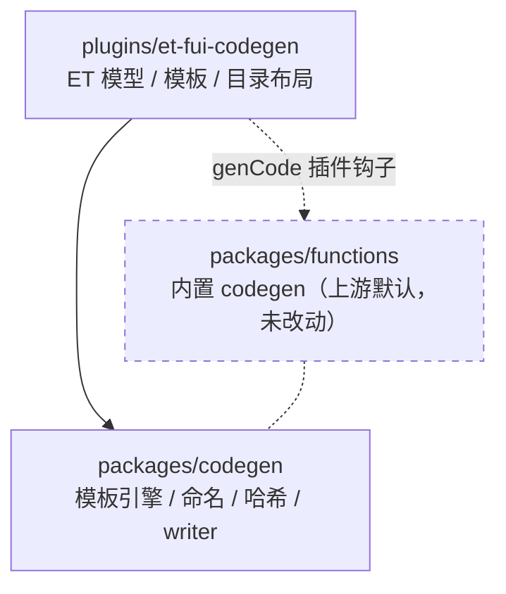

# Fork 下游代码生成策略

本 fork 相对上游 FairyGUI 官方仓库的代码生成策略：定制全部走插件层，不改动上游内置代码生成逻辑。

## 核心决策

| 决策 | 内容 |
|---|---|
| 发布代码生成入口 | 使用工程 `plugins/et-fui-codegen` 插件接管，不依赖 `packages/functions/src/codegen.ts` 的内置生成 |
| 上游内置 codegen 的处置 | 保持原样不动。它仍是上游官方用户的默认行为，属于上游资产 |
| 通用基础设施 | `packages/codegen` 提供模板引擎、命名、哈希、文件写入策略，零运行时依赖，与 functions 无任何引用关系 |
| 是否合并回上游结构 | 不合并。定制永远以新增目录形式存在，不侵入 `packages/functions` |

## 插件接管机制

发布链路的代码生成由 `genCode` 插件钩子排他接管：

1. `packages/functions/src/plugins/types.ts` 定义插件接口 `genCode?(doc, settings, options)`。
2. `publishCodeGeneration()` 在遍历插件时，只要有插件实现 `genCode` 并成功执行，内置生成立即跳过（`handled` 短路）。
3. Node 发布适配器自动加载工程 `plugins/` 目录下的所有插件。

因此只要工程存在可用的 `genCode` 插件，内置模板（Unity / Layabox / Cocos Creator 三套）对本工程的发布产物零影响。

## 依赖方向

- `et-fui-codegen → @openfairygui/codegen`：运行时依赖，单向。
- `et-fui-codegen → functions`：仅通过发布流程的插件钩子被调用，无代码级依赖。
- `functions → codegen`：无引用关系。codegen 包不 import 任何仓库内模块。

## 与上游内置 codegen 的关系

`packages/functions/src/codegen.ts` 存在一套与 `@openfairygui/codegen` 同名但行为不完全相同的私有实现（`renderTemplate` 为 `{{}}` 语法、`normalizeTypeName` 空值行为、`escapeCSharpString` 转义范围）。这些差异是实现编辑器兼容的协议级口径，属于已知技术债，不做统一：

- 内置输出必须与 FairyGUI 编辑器发布产物保持可对照，直接替换为 codegen 包实现会引入协议级回归风险。
- 统一动作需要逐函数迁移并配合三管线发布产物字节级回归，收益不匹配当前阶段。
- 重新评估的触发条件：出现第二个非 ET 的定制消费方，或实际踩到两套同名函数的行为差异。

## 上游同步影响面

定制全部隔离在纯新增目录，merge upstream 时冲突面最小：

| 区域 | 对上游文件的改动 | 同步上游时 |
|---|---|---|
| `plugins/et-fui-codegen/` | 纯新增 | 零冲突 |
| `packages/codegen/` | 纯新增 | 零冲突 |
| `packages/functions/` | 未改动 | 零冲突 |
| `tsconfig.json`、`.github/workflows/release.yml`、`README*`、`CHANGELOG*` | 少量附加性改动 | 偶发小冲突，人工核对即可 |

## 定制新目标模板的路径

新增目标框架（非 ET）时，不需要修改本 fork 的任何现有文件：

1. 新建 `plugins/<target>-codegen/`，依赖 `@openfairygui/codegen`。
2. 实现 `genCode(doc, settings, options)`，用 `renderTemplate` + 自有模板组装目标代码。
3. `export default { genCode }`，放入工程的 `plugins/` 目录，发布时自动接管内置生成。
